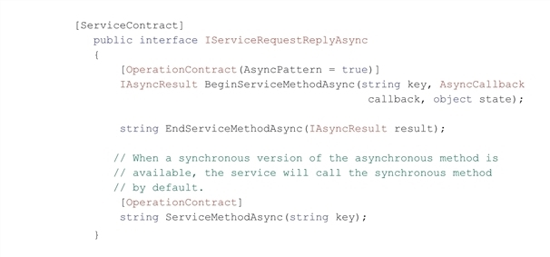
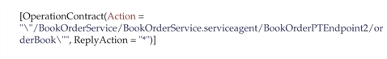
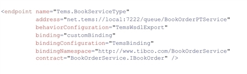

<table cellspacing="0">
  <col width="72px" />
  <col width="488px" />
  <tbody>
    <tr>
      <td>
        <b>Note</b>
      </td>
      <td>
        <p>While it has been updated to describe how to build and set up Transport Channel for WCF with TIBCO® EMS with recent versions of TIBCO Enterprise Message Service™, Microsoft® .NET Framework, and Microsoft Visual Studio®, the bulk of this document was last modified in 2012. As a result, a number of sections are outdated in that they refer to versions and features of products that are now dated or obsolete. These sections will be updated as needed.</p>
      </td>
    </tr>
  </tbody>
</table>

# Introduction

Microsoft Windows® Communication Foundation (WCF) provides a framework for extending transport channels beyond the standard provided by WCF, i.e., HTTP, TCP, named pipes, and MSMQ.

Transport Channel for WCF with TIBCO EMS allows you to use TIBCO Enterprise Message Service™ (EMS) as a transport channel for Windows Communication Foundation (WCF) services.

(Please note that the functionality included in Transport Channel for WCF with TIBCO EMS is substantially the same functionality previously made available with TIBCO Enterprise Message Service as TIBCO EMS Transport Channel for WCF, but which has since been deprecated. TIBCO does not provide any support for Transport Channel for WCF with TIBCO EMS.)


Transport Channel for WCF with TIBCO EMS ("TemsTransport channel") allows you to send and receive messages through the TIBCO EMS Server — they can be sent to either a queue or a topic on the server. Note that although WCF itself is Windows based, the TIBCO EMS Server can be running on any platform supported by the TIBCO EMS Server.

To use the TemsTransport channel, you will need to create a custom binding that specifies **TemsTransport** for the transport channel in your channel stack. The **TemsTransport** channel is configurable on both the client and host (service) ends. This is described in the remainder of this document.

## Interoperability

Transport Channel for WCF with TIBCO EMS can be used in the following environments:

* WCF application to WCF application

  

* WCF application to a web service that implements TIBCO’s SOAP over JMS protocol

  

* Non-WCF application to WCF application

  

For information about implementing these environments, see <span>[Interoperability](#interoperability-1).</span>

# Build and Setup

## Overview

Transport Channel for WCF with TIBCO EMS (Tems) consists of the following product features:

* <b>TEMS Transport Channel</b> - This provides the software needed to use TIBCO Enterprise Message Service (EMS) as a transport channel for Windows Communication Foundation (WCF) services: <code>TIBCO.EMS.WCF.dll</code>.

* <b>TEMS Protocol Activator </b>- This provides the software needed to use Windows Activation Service (WAS) to manage the activation and lifetime of the worker processes that contain applications that host WCF services that use TEMS transport channel: <code>NetTemsActivator.exe</code>.

### Requirements

Before building and setting up the product, review the topics in this section to determine that your system meets the basic requirements and that you have the prerequisite software installed.

#### Supported Platforms

Transport Channel for WCF with TIBCO EMS is supported on the following platforms:

* Microsoft Windows XP
* Microsoft Windows Server 2003
* Microsoft Windows Server 2008
* Microsoft Windows Server 2008 R2
* Microsoft Vista, SP1
* Microsoft Windows 7

#### Microsoft .NET Framework

Transport Channel for WCF with TIBCO EMS requires that you have Microsoft .NET Framework 4.7.2 or newer on the target machine.

#### TIBCO EMS 

You must have TIBCO Enterprise Message Service™ (EMS) version 8.6.0 installed on both the production and the development machines.

Also note that the only feature of EMS required by Transport Channel for WCF with TIBCO EMS is the C# Client, that is, the `TIBCO.EMS.dll`.

The `TIBCO.EMS.dll` must either be installed in the Windows Global Assembly Cache (GAC) (the recommended method), or it must be located on the file system and pointed to by the PATH environment variable. This allows Transport Channel for WCF with TIBCO EMS to find the `TIBCO.EMS.dll.`

#### Microsoft® Visual Studio® 2017

This software is needed only on machines on which you are performing development functions. Visual Studio is used to build, set up, and configure Transport Channel for WCF with TIBCO EMS product.

#### Microsoft Internet Information Services (IIS)

If you are going to use the **TEMS Protocol Activator** feature, that is, you are going to host your WCF service in Windows Activation Service (WAS), you must be using Microsoft Internet Information Services (IIS) 7 or 7.5:

* IIS 7 is available on Windows Server 2008 and Windows Vista.
* IIS 7.5 is available on Windows Server 2008 R2 and Windows 7.

Also, you *must* install certain features of IIS and WAS *before* registering the TEMS Protocol Activator.

After you’ve registered the TEMS Protocol Activator, you must perform additional steps to set up WAS before hosting your service.

For information about installing the required IIS features and WAS, as well as other tasks required to host your service in WAS, see [Setting Up a WAS Hosting Environment](#setting-up-a-was-hosting-environment).

## Building and Setting up Tems

This section describes building and setting up Transport Channel for WCF with TIBCO EMS.

### Building Tems and the Corresponding Samples

<table style="width: 560px; caption-side: top;" class="TableStyle-IconTable" cellspacing="0">
  <col width="72px" class="TableStyle-IconTable-Column-Column1" />
  <col width="488px" class="TableStyle-IconTable-Column-Column2" />
  <tbody>
    <tr class="TableStyle-IconTable-Body-Body1">
      <td class="TableStyle-IconTable-BodyB-Column1-Body1">
        <p class="IconNote">
          <span class="autonumber">
            <span>
              <b>Note</b>
            </span>
          </span> </p>
      </td>
      <td class="TableStyle-IconTable-BodyA-Column2-Body1">
        <p>If you are going to use the <b>TEMS Protocol Activator</b> feature, that is, you are going to host your WCF service in Windows Activation Service (WAS), you <i>must</i> install certain features of IIS and WAS <i>before</i> installing the TEMS Protocol Activator. </p>
        <p>After you’ve registered the TEMS Protocol Activator, you must perform additional steps to set up WAS before hosting your service. </p>
        <p>For information about installing the required IIS 7.0/7.5 features and WAS, as well as other tasks required to host your service in WAS, see <a href="#setting-up-a-was-hosting-environment">Setting Up a WAS Hosting Environment</a>.</p>
      </td>
    </tr>
  </tbody>
</table>

To build Transport Channel for WCF with TIBCO EMS:

- Install TIBCO EMS, Microsoft .NET Framework, and Microsoft Visual Studio.
  - Upon installing Visual Studio, make sure to include the _.NET Desktop Development_ Workload.
  - The Tems build scripts are tailored to run with Microsoft Visual Studio 2017. Using a different version will require adjustments.
- Clone the present GitHub repository onto your `C:\` volume. The rest of this procedure assumes it resides at `%TEMS_ROOT%`.
- Generate your own _Strong Name Key_ file for the `Net.Tems` listener adapter service (`NetTemsActivator.exe`):
  - `cd %TEMS_ROOT%\NetTemsActivator`
  - `sn -k NetTemsActivator.snk`
- Generate your own _Strong Name Key_ file for the WAS custom binding sample:
  - `cd %TEMS_ROOT%\samples\WAS\Custom\CustomTemsBinding`
  - `sn -k CustomTemsBinding.snk`
- `cd` to `%TEMS_ROOT%` and run `Tems.Build.cmd`. You may need to run it twice.

### Setting up Tems

Depending on the features you are going to use, setting up Transport Channel for WCF with TIBCO EMS involves registering the <code>TIBCO.EMS.WCF.dll</code> in the GAC and registering the <code>NetTemsActivator.exe</code> as a Windows service.

#### Signing and Registering the TEMS Transport Channel in the Global Assembly Cache

To sign the <code>TIBCO.EMS.WCF.dll</code> using Microsoft Visual Studio:

1. Open the <code>Tems.sln</code> solution in Visual Studio
1. Go to the Solution Explorer (<b>View > Solution Explorer</b>).
1. Double-click on <b>TemsTransport > Properties</b>.
1. Select the <b>Signing</b> tab.
1. Check the <b>Sign the assembly</b> checkbox.
1. Browse to and choose a _Strong Name Key_ file or create a new one.
1. Save these changes.
1. Rebuild the <code>TIBCO.EMS.WCF.dll</code> as done earlier.

To register the <code>TIBCO.EMS.WCF.dll</code> in the GAC, use the <code>GACSetup.exe</code> utility provided with TIBCO Enterprise Message Service.

- As Administrator, run the following command from your root directory:  
  <code>%EMS_ROOT%\\.uninstall\GACSetup.exe install %TEMS_ROOT%\BuildArtifacts\TIBCO.EMS.WCF.dll</code>  
- You can verify the presence of the <code>TIBCO.EMS.WCF</code> directory in the GAC (typically in <code>%windir%\Microsoft.NET\assembly\GAC_64</code>).

You will then need to specify the corresonding _PublicKeyToken_ in the <code>app.config</code> file of your applications that use Tems. For example:

```properties
<configuration>
  <system.serviceModel>
    <extensions>
      <bindingElementExtensions>
        <add name="TemsTransport" type="com.tibco.wcf.tems.TemsTransportExtensionElement, TIBCO.EMS.WCF, Version=2.0.0.0, Culture=neutral, PublicKeyToken=4eba9e761ecf2ed1"/>
```

#### Registering the TEMS Protocol Activator as a Windows service

Please follow Microsoft's guidelines to register the <code>NetTemsActivator.exe</code> as a Windows service. We will call it the <code>Net.Tems</code> listener adapter.

This service contains the components needed to host a WCF service in WAS when using the TemsTransport protocol.

Once this is done, you should end up with:

* The **net.tems** listener adapter registered in the `%windir%\System32\inetsrv\config\ApplicationHost.config` file by an entry being added to the <**listenerAdapter**s> element, as follows:

  

  When the **net.tems** listener adapter service is started, it will update the identity of the user/account to that of the user running the service, if it is different than what is specified.

  Note that if you change the identity of the user/account for **net.tems** in `ApplicationHost.config,` you must also change it in Services. For more information, see <span>[Service Logon Account](#service-logon-account).</span>

* Additional entries in both the <**protocols**> and <**serviceHostingEnvironment**> elements of the machine-level `web.config` file.
  
  Location of the machine-level `web.config` file (note that .NET Framework v2.0 is used as a base even though you may have .NET Framework v3.0 or 3.5 installed):

  <code>%windir%\Microsoft.Net\Framework64\v2.0.50727\CONFIG\web.config</code>

The process and application domain protocol handlers are registered in <**protocols**>:


And the transport configuration type that the service hosting environment instantiates for the TEMS transport protocol is specified in the <**serviceHostingEnvironment**> element:


Additionally, in order to comply with the "Works with Windows 2008" standards from Microsoft, <code>NetTemsActivator.exe</code> needs to be copied to the <code>%SystemRoot%</code> directory (which defaults to <code>\Windows</code>).

# Samples

A Microsoft Visual Studio "Samples" solution is located under <code>samples\Tems</code>.

In order to run these, you may need to configure namespace reservations using the Microsoft `netsh` tool.
  - See here for details: https://docs.microsoft.com/en-us/dotnet/framework/wcf/feature-details/configuring-http-and-https
  - For example: `netsh http add urlacl url=http://+:8000/mex user=DOMAIN\user`

The sample solution includes the following projects:

* Client
* Service
* Host
* BookOrderService
* Client.MEX
* CustomMessageProtocol
* Authentication

These are described in the following subsections.

## Client, Service, and Host Projects

The Client, Service, and Host projects comprise the heart of the Samples solution. These provide example usage of:

* the three available Message Exchange Patterns (MEPs): datagram, full duplex, and request-reply,
* both sessionless and sessionful channels, and
* synchronous and asynchronous service operations.

The application configuration files (`App.config`) in the Client and Host projects provide examples of the configurations needed to communicate between the client and service using Transport Channel for WCF with TIBCO EMS.

There is also a Sample launch utility (`...\samples\Tems\Launch.Samples.cmd`) provided that can be used to start each of the sample Service applications. It presents prompts that allow you to choose the type of client/service to run:


Before starting the launch utility, you must compile the Sample solution.

<table cellspacing="0">
  <col width="72px" />
  <col width="488px" />
  <tbody>
    <tr>
      <td>
        <b>Note</b>
      </td>
      <td>
        <p>The Destinations (queues or topics) referenced as endpoints in the samples must be configured on the EMS Server, otherwise the endpoint will fail and an error is written to the TemsTrace log. For more information, see <a href="#destination-configuration-on-the-ems-server">Destination Configuration on the EMS Server</a>.</p>
      </td>
    </tr>
  </tbody>
</table>

The following examples are provided in the **Samples** solution, in both the **Client** project (`SampleClient.cs`) and the **Host** project (`SampleService.cs`):

* **SetConnectionFactoryExample**

  Shows how a pre-configured or administered ConnectionFactory can be set on the TemsTransportBindingElement ConnectionFactory property.

* **SetJNDIConnectionFactoryExample**

  Shows how an administered ConnectionFactory can be retrieved using JNDI and set on the TemsTransportBindingElement ConnectionFactory property.

* **SetSSLConnectionFactoryExample**

  Shows how EMS SSL properties can be set on a ConnectionFactory instance.

* **SetSSLBindingPropertiesExample**

  Shows how EMS SSL properties can be set on the TemsTransportBindingElement. Note: This has no affect on a ConnectionFactory set using the TemsTransportBindingElement.ConnectionFactory property.

* **SetEndpointDestinationExample**

  Shows how a pre-configured or administered endpoint Destination can be set on the TemsTransportBindingElement EndpointDestination property.

* **SetCallbackDestinationExample**

  Shows how a pre-configured or administered callback Destination can be set on the TemsTransportBindingElement CallbackDestination property.

* **SetCustomMessageProtocolExample**

  Shows how a custom implementation of TemsMessageProtocol : ITemsMessageProtocol can be set on the TemsTransportBindingElement CustomMessageProtocol property.

* **AppManagesConnectionsExample**

  Shows how an application can manage (create, share, close) EMS connections. You must set `AppManagesConnections = true` in the `App.config` file if the application is managing EMS connections. See [appManagesConnections](#appmanagesconnections).

  Note that this can be done in either the client or the service, but the example is only provided in the client (`SampleClient.cs`).

* **ManipulatePasswordExample**

  Shows how to manipulate the password so that it is not shown as clear text in the configuration file. This example uses the **Manage** method on the **ITemsPassword** interface.

* Message Selector Example

  An example of how to use the **messageSelector** attribute to specify that the server deliver only specific messages to the consumer. Note that this example is part of the **SetCustomMessageProtocolExample** (search for  "Message Selector Example" in `CustomMessageProtocol\SampleMessageProtocol.cs`).

## BookOrderService Project

This project provides an example of using TIBCO’s SOAP Over JMS protocol, which allows interoperability with TIBCO ActiveMatrix BusinessWorks™ web services.

This project is based on the sample project that is distributed with TIBCO ActiveMatrix BusinessWorks. Using a WSDL-first approach, the WSDL that is produced by the TIBCO BusinessWorks sample project was imported into the **svcutil** utility to create the client proxy.

For more information about using SOAP Over JMS, see [Interoperability](#Interoperability-1).

## Client.MEX Project

This project provides an example of using WS-MetadataExchange (WS-MEX), a protocol that allows clients to interrogate a service endpoint to extract metadata, then use that metadata to generate a proxy for the purpose of sending compatible messages to the service.

For more information about using metadata exchange, see [Using WS-MetadataExchange With Tems](#using-ws-metadataexchange-with-tems).

## CustomMessageProtocol Project

This project provides an example of a non-WCF application communicating with a WCF Service that requires custom mapping between the EMS message and the WCF message.

For more information about this type of implementation, see [Non-WCF Application to WCF Application](#non-wcf-application-to-wcf-application).

## Authentication Project

This project provides an example of using authentication. It is not specific to using Transport Channel for WCF with TIBCO EMS.

## Sample Destination Configuration on the EMS Server

The destinations (queues or topics) referenced as endpoints in the samples must be configured on the EMS Server prior to running the samples, otherwise the endpoint will fail and an error is written to the TemsTrace log. For more information, see <a href="#destination-configuration-on-the-ems-server">Destination Configuration on the EMS Server</a>.

The specific destinations used in the Samples solution can be added to the EMS Server in one of the following three ways:

* By editing the `queues.conf` file, adding the following lines:

```Tems.RequestReplyAsyncEP 
    Tems.RequestReplyEP 
    Tems.MEX 
    Tems.DatagramEP 
    Tems.DuplexEP 
    Tems.DuplexTransactionEP 
    Tems.RequestReplySessionEP 
    Tems.DatagramSessionEP 
    Tems.DuplexSessionEP 
    Tems.Queue.Endpoint 
    Tems.Queue.Callback
```

* By using the EMS administrative console to manually add the destinations.
* Dynamically, if the EMS Server allows dynamic destinations.

  For information, see *Wildcards and Dynamically Created Destinations* in the *TIBCO Enterprise Message Service™ User’s Guide.*

Also note that the following JNDI lookup destinations (which are used in the **SetEndpointDestinationExample()** and **SetCallbackDestinationExample()** methods) must exist before doing the lookup:

* Tems.Queue.Endpoint
* Tems.Queue.Callback

## Referencing the EMS DLL in the Samples

Transport Channel for WCF with TIBCO EMS samples must reference the EMS C# Client, that is, the `TIBCO.EMS.dll`.

When you open the Samples solution in Microsoft Visual Studio, the "TIBCO.EMS" in the client and the host will show a problem icon, indicating it does not know the location of the DLL:

 

You must re-reference it by first removing the existing reference, right-clicking on **References**, then selecting **Add Reference**. On the **Add Reference** dialog, browse to the location of "TIBCO.EMS.dll" and select it.

## Windows Process Activation Service (WAS) Samples

WAS samples are located here:

samples\WAS

Three WAS samples are included:

* **Basic** - This sample implements a simple client and service.
* **Multi-Endpoint** - This sample demonstrates how to implement multiple WCF contracts in one IIS application. The service implements three WCF contracts (IDatagramContract, ICalculatorContract, IStatusContract), using different bindings. The IStatusContract has an endpoint with **basicHttpBinding**, while the other contracts use a TEMS bindings.
* **Custom** - This sample demonstrates how to implement a custom TEMS binding element. If you are using SSL, creating a connection factory, or other runtime initialization of the TEMS binding, you will also need to implement a custom servicehost factory. This example also shows how this can be done.

For more information about these WAS samples, see the `readme.txt` file that is included in the `...\samples\WAS `directory.

To run these samples, you must also set up the TEMS Protocol Activator: <code>NetTemsActivator.exe</code>.  
See [Registering the TEMS Protocol Activator as a Windows service](#registering-the-tems-protocol-activator-as-a-windows-service).

## Manual Application Message Acknowledgement in Samples

The samples distributed with Transport Channel for WCF with TIBCO EMS provide an example of manually acknowledging receipt of a message. For more information about application message acknowledgement, see [Manual Application Message Acknowledgement](#manual-application-message-acknowledgement).

To demonstrate application message acknowledgement in the samples:

<ol>
  <li value="1">Set the <a href="#apphandlesmessageacknowledge">appHandlesMessageAcknowledge</a> attribute to true in the <code>app.config</code> file in both the client and the host.</li>
  <li value="2">Set the <a href="#sessionacknowledgemode">sessionAcknowledgeMode</a> attribute to <b>ExplicitClientAcknowledge</b> in the <code>app.config</code> file in both the client and the host.</li>
  <li value="3">To enable the application message acknowledgement code in the samples, add the conditional compilation symbol ’<code>ManualAcknowledgeSample</code>’ on the project properties <b>Build</b> tab for the client and service projects.</li>
  <li value="4">Re-compile the solution.</li>
  <li value="5">To manually acknowledge the EMS message, launch the samples using the launch utility (<code>Launch.Samples.cmd</code> — for information <a href="#client-service-and-host-projects" class="MCXref_0">Client, Service, and Host Projects</a>). </li>
</ol>

# Configuring the TemsTransport Channel

This chapter describes how to configure and use the **TemsTransport** channel.

* [Getting Started](#getting-started)
* [Configuring your Client and Service to use TemsTransport ](#configuring-your-client-and-service-to-use-temstransport)
* [Programmatic Access](#programmatic-access)
* [Message Exchange Patterns](#message-exchange-patterns)
* [Interoperability](#interoperability-1)
* [Using WS-MetadataExchange With Tems](#using-ws-metadataexchange-with-tems)
* [ConnectionFactory](#connectionfactory)
* [Manual Application Message Acknowledgement](#manual-application-message-acknowledgement)
* [SSL Communications](#ssl-communications)
* [Tems Trace Logging](#tems-trace-logging)
* [Destination Configuration on the EMS Server](#destination-configuration-on-the-ems-server)
* [Creating a Tems Client in WCF from a BusinessWorks WSDL](#creating-a-tems-client-in-wcf-from-a-businessworks-wsdl)

## Getting Started

The `TIBCO.EMS.WCF.dll` defines binding attributes that are used to configure the TemsTransport channel in the application configuration file.

<table cellspacing="0">
  <col width="72px" />
  <col width="488px" />
  <tbody>
    <tr>
      <td>
        <b>Note</b>
      </td>
      <td>
        <p>Note that if you are going to be using Windows Process Activation Service (WAS) to host your WCF service, do not use this section to configure your client and service. Instead, use the information provided in <a href="#windows-process-activation-service">Windows Process Activation Service</a>.</p>
      </td>
    </tr>
  </tbody>
</table>

<table cellspacing="0">
  <col width="72px" />
  <col width="488px" />
  <tbody>
    <tr>
      <td>
        <b>Note</b>
      </td>
      <td>
        <p>The destinations (queues or topics) referenced as endpoints must be configured in the EMS Server prior to running your service, otherwise the endpoint will fail and an error is written to the TemsTrace log. For more information, see <a href="#destination-configuration-on-the-ems-server">Destination Configuration on the EMS Server</a>.</p>
      </td>
    </tr>
  </tbody>
</table>

To use the TemsTransport channel to define the binding attributes that are used to configure the transport, you must add a reference to `TIBCO.EMS.WCF.dll` in both your client and service projects in Microsoft Visual Studio. You must also add an Application Configuration file to both the client and service so the TemsTransport channel can be configured.

### Adding a Reference to TemsTransport and EMS

Both your client and service must have a reference to the TemsTransport DLL and the EMS DLL. To add these references, follow these steps:

<ol>
  <li value="1">In the Solution Explorer in Visual Studio, right click on <b>References</b> in your client project, then select <b>Add Reference</b>.</li>
  <li value="2">
    <p>In the <b>Add Reference</b> dialog, click on the <b>Browse</b> tab, then point to the <code>TIBCO.EMS.WCF.dll</code> file that you have previously built.</p>
  </li>
  <li value="3">
    <p>Repeat steps 1 and 2 to add a reference to the EMS DLL (TIBCO.EMS.dll). It is located as follows:</p>
    <p>
      <code>   𝑇𝐼𝐵𝐶𝑂_𝐻𝑂𝑀𝐸\ems\𝑣𝑒𝑟𝑠𝑖𝑜𝑛\bin</code>
    </p>
    <p>where <code>𝑣𝑒𝑟𝑠𝑖𝑜𝑛</code> is the version of EMS. </p>
    <p>The references should now look similar to the following:</p>
    <p>
      <a href="images/add_reference.gif">
        
      </a>
    </p>
  </li>
  <li value="4">Repeat the steps above for your service project.</li>
</ol>

### Including an Application Configuration File

Both your client and service must have an Application Configuration file (`App.config`). To add this file to your projects, follow these steps:

<ol>
  <li value="1">In the Solution Explorer in Visual Studio, right click on your client project, then select <b>Add </b> > <b>New Item</b>.</li>
  <li value="2">In the <b>Add New Item </b>dialog, select <b>Application Configuration File</b> in the <b>Templates</b> window. Leave the default name of <b>App.config</b>.</li>
  <li value="3"><p>Click <b>Add</b>.</p>
    <p>
      <b>App.config</b> will now appear in your client project:</p>
    <p>
      <a href="images/add_app.config.gif">
        
      </a>
    </p>
  </li>
  <li value="4">Repeat the steps above to add an <code>App.config</code> file to the host project.</li>
</ol>

After you’ve added a reference to the `TIBCO.EMS.WCF.dll` and `TIBCO.EMS.dll, `and you’ve added an application configuration file, you can then add the specific binding elements to your project that allows it to use the TemsTransport channel. This is explained in the following sections.

## Configuring your Client and Service to use TemsTransport 

Configuring your client and service to use the TemsTransport channel can be accomplished in one of two ways:

* By directly adding the appropriate XML elements and attributes to the application configuration files (`App.config`) in your client and service projects.  
  This method, along with descriptions of the XML elements and attributes is described in <span>[Adding XML Directly to Projects](#adding-xml-directly-to-projects).</span>
* By using the Microsoft Service Configuration Editor.  
  This method, in the form of a tutorial, is described in <span>[Using the Microsoft Service Configuration Editor](#using-the-microsoft-service-configuration-editor).</span>

Whichever method you use — directly adding XML or using the configuration utility — there are three primary tasks involved in adding the TemsTransport channel to your project:

* Creating a binding element extension
  * This is an extension to the standard WCF binding elements.
* Creating a custom binding
  * This defines the communication elements: transport channel, message encoding, message exchange pattern, security, and reliability.
* Creating endpoints
  * This defines the client and service endpoints and the service contract.

Once you’ve completed these tasks, your client should be able to successfully invoke operations provided by the service, using EMS as the transport channel.

### Adding XML Directly to Projects

This section describes how to add the TemsTransport channel to your client and service by adding the appropriate XML elements directly to your projects.

The TemsTransport channel is configured through the use of application configuration files, `App.config`. There are separate configuration files for the client and the service.

The following provides information about the XML that must be added to your client and service configuration files. Additional information about the elements and attributes in the XML is provided on the following pages.

<ol>
  <li value="1">Create a binding element extension.</li>
  <li value="2">
    <p>Use this extension to create a custom binding configuration.</p>
    <p>
      <a href="images/2_11.jpg">
        
      </a>
    </p>
  </li>
  <li value="3">Add a client endpoint/service endpoint.</li>
</ol>

On the client:


On the service:


The following shows the minimum that must be specified in the application configuration file on the client:


And the following shows the minimum that must be specified in the application configuration file on the service:


After you’ve added the XML shown above to your client’s and service’s `App.config` files, then saved and built your project, you should be able to successfully run your service and client. (Ensure that the EMS Server is running.)

The following pages provide information about the XML elements related to the TemsTransport channel.

##### &lt;endpoint&gt;

This specifies the service’s address, the binding used, and the service contract. It contains the following attributes:

* **address** - This is the address to the service. It is composed of the following:   ```net.tems://<ℎ𝑜𝑠𝑡>:<𝑝𝑜𝑟𝑡>/<𝑝𝑎𝑡ℎ>```
where:
   * **net.tems** is the URI Scheme for the TemsTransport that denotes that the address is pointing to a queue or a topic on an EMS Server.
   * ```<ℎ𝑜𝑠𝑡>``` is the name of the host on which the EMS Server is running. This can be "localhost" if it is running on the same machine on which the client and service reside.
   * ```<𝑝𝑜𝑟𝑡>``` is the port on which EMS is communicating.
   * ```<𝑝𝑎𝑡ℎ>``` is the path to a queue or topic on the EMS Server. It consists of either:

```
      .../topic/destinationName
```

or

```
      .../queue/destinationName
```

* **binding** - This must specify "customBinding" so that WCF uses the binding you’ve specified in the <**customBinding**> element.
* **bindingConfiguration** - This specifies the name of the binding configuration to use for this endpoint. The binding configuration is defined in the <**binding**> element under <**customBinding**> — see below.
* **contract** - The name of the service contract this endpoint is exposing.
* **name** - This optional string attribute uniquely identifies an endpoint for a given contract.  You can define multiple endpoints/clients for a given contract type.  Each definition must be differentiated by a unique configuration name.  If this attribute is omitted, the corresponding endpoint is used as the default endpoint associated with the specific contract type.  The default is an empty string.

##### &lt;customBinding&gt;

This element is used to create custom bindings when the standard bindings provided by WCF don’t include the binding elements you need. In this particular case, a binding that includes the TemsTransport channel is needed.

A <**binding**> element must be included for each desired custom binding. The **name** attribute specifies a name for the custom binding. This name must be specified in the <**Endpoint**> element’s **bindingConfiguration** attribute:


The <**binding**> element contains a list of *binding elements* that are used to build the channel stack. The binding elements specified here are:

* <**binaryMessageEncoding**> - This specifies that messages are sent over the wire in binary format.

  In this example, binaryMessageEncoding has been chosen for the message encoding. You can choose whatever message encoding fits your needs. You can also include other binding elements that you may need. The point of this example is that TemsTransport is selected as the transport channel.

* <**TemsTransport**> - This binding element specifies that the transport channel is defined as a *binding element extension*, that is, it is defined in the <**bindingElementExtensions**> element in the configuration file.

  You can use any name desired for this element. The name used, however, must be referenced in the **name** attribute of the <**bindingElementExtensions**> element, as illustrated below:

  

  <a name="tcbe"></a>There are also a number of attributes that can be included with the binding element (<**TemsTransport**> in this example). These allow you to specify configuration settings, such as the maximum message size, message priority, etc.

  Any attributes that are not specifically listed under the binding element in the `App.config` file take on their respective defaults. The default values for each of the attributes are provided in [Configuration Attributes](#configuration-attributes).

  The following shows the attributes that can be included with the transport channel binding element:

   ```properties
   <TemsTransport maxBufferPoolSize="524288"
   maxReceivedMessageSize="65536"

   allowAdministratedConnFactory="true"
   allowAdministratedEndpointDest="true"
   allowAdministratedCallbackDest="true"
   allowBindingChanges="true"
   allowCustomMessageProtocol="true"

   clientID=""
   connAttemptCount="-1"
   connAttemptDelay="-1"
   connAttemptTimeout="-1"
   loadBalanceMetric="Connections"
   reconnAttemptCount="-1"
   reconnAttemptDelay="-1"
   reconnAttemptTimeout="-1"

   serverUrl=""

   certificateStoreType="EMSSSL_STORE_TYPE_DEFAULT"
   certificateStoreLocation="LocalMachine"
   certificateStoreName=""
   certificateNameAsFullSubjectDN=""
   sslClientIdentity=""
   sslPassword=""
 
   sslAuthOnly="false"
   sslProxyHost=""
   sslProxyPort="-1"
   sslProxyAuthUsername=""
   sslProxyAuthPassword=""
   sslTrace="false"
   sslTargetHostName=""
   username=""
   password=""
 
   sessionAcknowledgeMode="AutoAcknowledge"

   messageDeliveryMode="Persistent"
   disableMessageID="false"
   disableMessageTimestamp="false"
   priority="4"
   timeToLive="0"
 
   messageCompression="false"
 
   messageType="Text"
   throwOnInvalidUTF="true"
 
   messageProtocol="WCFNative"
 
   customMessageProtocolType="com.tibco.sample.custom.SampleMessageProtocol, CustomMessageProtocol, Version=1.0.0.0, Culture=neutral, PublicKeyToken=null"
 
   wsdlExportExtensionType=""
   wsdlExtensionActive="true"
   wsdlTypeSchemaImport="false"
 
   clientBaseAddress=""
   appHandlesMessageAcknowledge="false"
   appManagesConnections="false"
   messageSelector=""
 
   replyDestCheckInterval="00:01:00" />
   ```

   For information about these configuration attributes, see [Configuration Attributes](#configuration-attributes).

##### &lt;bindingElementExtensions&gt;

This element contains a collection of custom binding element extensions. Each is added to the collection using the **add** keyword. In this example, a custom binding element extension named "TemsTransport" has been added:


The name given to the binding element extension is referenced in the custom binding specification, as shown above.

The binding element extension’s **type** attribute contains the following information:

* **com.tibco.wcf.tems.TemsTransportExtensionElement** - This is an extension of the **BindingElementExtensionElement** class that specifies the binding attributes used to configure the TemsTransport channel.
* **TIBCO.EMS.WCF** - This is the name of the assembly file that contains the TemsTransport channel.
* **Version**- This is the version of the assembly.
* **Culture**- This is the locale of the assembly. Library assemblies (i.e., DLLs) should always be culture neutral.
* **PublicKeyToken** - This is a 64-bit hash of the public key that corresponds to the private key used to sign the assembly. As the assembly is signed, it is considered to be *strongly named*.

### Using the Microsoft Service Configuration Editor

This section describes using the Microsoft Service Configuration Editor to add the appropriate TemsTransport XML elements/attributes to the application configuration (`App.config`) files.

After you’ve added the TemsTransport XML elements/attributes to your client’s and service’s `App.config` files using the Microsoft Service Configuration Editor as described below, then saved and built your project, you should be able to successfully run your service and client. (Ensure that the EMS Server is running.)

The configuration process using the Service Configuration Editor is different for the client and the service. Each is described below.

#### Configuring the Service

The procedure described here assumes you have opened your solution in Visual Studio 2017 and performed the steps provided in <span>[Getting Started](#getting-started), i.e., you have added a reference to the TemsTransport channel (the `TIBCO.EMS.WCF.dll` file) to the service project, as well as added an application configuration file to the project.</span>

<ol>
  <li value="1">
    <p>Open the service’s <b>App.config</b> file with the Service Configuration Editor. To do this, follow these steps:</p>
  </li>
  <ol>
    <li value="i">
      <p>In the Solution Explorer, right-click on <b>App.config </b>and select <b>Open With...</b>.</p>
      <p>Note that the first time you perform these steps, you will need to add the Service Configuration Editor to the <b>Open With</b> dialog. To do this, click on the <b>Add</b> button, then use the browse button to the right of the <b>Program name</b> field to locate the utility. It can be found at the following location:</p>
      <pre>      &lt;<i>Program Files</i>&gt;\Microsoft SDKs\Windows\v6.0a\bin\SvcConfigEditor.exe</pre>
      <p>Enter the desired name in the <b>Friendly name</b> field, e.g., "SrvConfigEditor", then click <b>OK</b>.</p>
    </li>
    <li value="-">
      <p>Select the Service Configuration Editor in the <b>Open With</b> dialog, then click <b>OK</b>.</p>
    </li>
  </ol>
  <p>The <b>Microsoft Service Configuration Editor</b> dialog is displayed.</p>
  <li value="2">
    <p>In the <b>Configuration</b> tree on the left side of the dialog, expand <b>Advanced</b> &gt; <b>Extensions</b>, then click on <b>binding element extensions</b>.</p>
    <p>A list of the available binding element extensions appear on the right side of the dialog:</p>
    <p>
      <a href="images/srv_config_editor_-_service.gif">
        
      </a>
    </p>
  </li>
  <li value="3">Click the <b>New</b> button. The <b>Extension Configuration Element Editor</b> dialog is displayed. This dialog allows you to add a new binding element extension to the list. <p><a href="images/extension_configuration_element_editor.gif"></a></p></li>
  <li value="4">
    <p>Add a new binding element extension by following these steps:</p>
  </li>
  <ol>
    <li value="a">
      <p>In the <b>Name</b> field, enter "TemsTransport".</p>
    </li>
    <li value="b">
      <p>Click in the <b>Type</b> field, then click on the browse button that appears on the right side of the field.</p>
      <p>The <b>Binding Element Extension Type Browser</b> dialog is displayed.</p>
    </li>
    <li value="c">
      <p>Click on the <b>GAC</b> icon in the section on the left side of the dialog. <br />(Note - you have already registered the <code>TIBCO.EMS.WCF.dll</code> library in the Global Assembly Cache (GAC) as part of the intial Tems setup.)</p>
    </li>
    <li value="d">
      <p>From the list of assemblies that appears on the right, locate and select "TIBCO.EMS.WCF", then click <b>Open</b>.</p>
    </li>
    <li value="5">
      <p>Click on the "com.tibco.wcf.tems.TemsTransportExtensionElement" selection that appears, then click <b>Open</b>.</p>
    </li>
    <li value="6">
      <p>Click <b>OK</b> on the <b>Extension Configuration Element Editor </b>dialog.</p>
    </li>
  </ol>
  <p>"TemsTransport" will now appear in the list of available binding element extensions.</p>
  <li value="5">Select <b>Save</b> from the <b>File</b> menu. </li>
  <li value="6">Click on the <b>Bindings</b> node on the left side of the <b>Service Configuration Editor</b> dialog.</li>
  <li value="7">Click on the <b>New Binding Configuration</b> link.</li>
  <p>The <b>Create a New Binding</b> dialog is displayed.</p>
  <li value="8">
    <p>Select "customBinding", then click <b>OK</b>.</p>
    <p>The following is displayed, which allows you to specify the binding elements in the custom binding. These will be used to build the channel stack:</p>
    <p>
      <a href="images/custombinding_config_-_service.gif">
        
      </a>
    </p>
  </li>
  <li value="9">
    <p>In the <b>Name</b> field, enter "TemsBinding".</p>
    <p>Notice that, by default, two binding elements are specified for the new custom binding: textMessageEncoding and httpTransport. These need to be removed.</p>
  </li>
  <li value="10">In the <b>Binding element extension position</b> section, remove both the textMessageEncoding and httpTransport elements by selecting them and clicking the <b>Remove</b> button.</li>
  <li value="11">At this point the editor requires that you select <b>File</b> > <b>Save</b> again, otherwise you will get an error message telling you that the extension is not registered in the extension collection ’bindingElementExtensions’.</li>
  <li value="12">Click the <b>Add</b> button. The <b>Adding Binding Element Extension Sections</b> dialog is displayed.</li>
  <li value="13">
    <p>Select "TemsTransport" and "binaryMessageEncoding", then click <b>Add</b>. </p>
    <p>The binding element stack should now appear as follows:</p>
    <p>
      <a href="images/binding_element_stack.gif">
        
      </a>
    </p>
    <table cellspacing="0">
      <col width="72px" />
      <col width="488px" />
      <tbody>
        <tr>
          <td>
            <b>Note</b>
          </td>
          <td>
            <p>In this example, binaryMessageEncoding was chosen for the message encoding. You can choose whatever message encoding fits your needs. You can also include other binding elements that you may need. The point of this example is that TemsTransport is selected as the transport channel.</p>
          </td>
        </tr>
      </tbody>
    </table>
  </li>
  <li value="14">Click on the <b>Services </b>node on the left side of the <b>Service Configuration Editor</b> dialog.</li>
  <li value="15">
    <p>Click on the <b>Create a New Service </b>link.</p>
    <p>The <b>New Service Element Wizard </b>dialog is displayed.</p>
  </li>
  <li value="16">Click the <b>Browse</b> button to the right of the <b>Service type</b> field.</li>
  <li value="17">
    <p>Locate and select the <i>service</i> file from your service’s <code>\bin\Debug</code> folder, then click <b>Open</b>. </p>
    <p>The name of the service implementation will now appear in the <b>Type Browser</b> window.</p>
  </li>
  <li value="18">Select the service implementation and click <b>Open</b>.</li>
  <li value="19">
    <p>Click <b>Next</b> on the <b>New Service Element Wizard</b> dialog.</p>
    <p>The next window will contain a <b>Contract</b> field that is prefilled with the name of the service contract for the service.</p>
  </li>
  <li value="20">Click <b>Next</b>. </li>
  <li value="21">Select the <b>Existing binding configuration</b> radio button.</li>
  <li value="22">From the <b>Binding configuration</b> field drop-down list, select "TemsBinding, customBinding", then click <b>Next</b>.</li>
  <li value="23">
    <p>Enter the address of the endpoint in the <b>Address</b> field, then click <b>Next</b>. This is the address to the service. It is composed of the following:</p>
       <code>net.tems://<ℎ𝑜𝑠𝑡>:<𝑝𝑜𝑟𝑡>/<𝑝𝑎𝑡ℎ></code>
    <p>where:</p>
    <p>For example: <code>net.tems://localhost:7222/queue/queue.sample</code></p>
    <p>The wizard now displays a screen that summarizes the service settings.</p>
  </li>
  <ul>
    <li>
      <b>net.tems</b> denotes that the address is pointing to a queue or a topic on an EMS Server.</li>
    <li><code><ℎ𝑜𝑠𝑡></code> is the name of the host on which the EMS Server is running. This can be "localhost" if it is running on the same machine on which the client and service reside.</li>
    <li><code><𝑝𝑜𝑟𝑡></code> is the port on which EMS is communicating.</li>
    <li><code><𝑝𝑎𝑡ℎ></code> is the path to a queue or topic on the EMS Server. </li>
  </ul>
  <li value="24">Verify the settings, then click <b>Finish</b>.</li>
  <li value="25">Save your changes: select <b>File > Save</b>.</li>
  <li value="26">Exit the editor: select <b>File > Exit</b>.</li>
</ol>

If you now open the `App.config` file, you will see the XML that the editor created:


This is the same XML that would need to be added manually if you did not use the Service Configuration Editor — see <span>[Adding XML Directly to Projects](#adding-xml-directly-to-projects).</span>

##### Transport Channel Configuration on the Service

There are a number of configuration parameters associated with the transport channel. These allow you to specify things such as the maximum message size, message priority, etc.

As described in <span>[this section](#tcbe), attributes can be added directly to the `App.config` file XML to configure the TemsTransport channel — they are added to the binding element (&lt;**TemsTransport**&gt; in our example). </span>

If the binding element is included without attributes (as in this example), they all take on their respective defaults.


The Service Configuration Editor can be used to modify any of the available configuration parameters. To do this, follow these steps:

<ol>
  <li value="1">Open the service’s <code>App.config</code> file with the Service Configuration Editor.</li>
  <li value="2">
    <p>Expand the <b>Bindings </b>node on the left side of the <b>Service Configuration Editor</b> dialog and select the transport channel binding element:</p>
    <p>
      <a href="images/binding_element_-_service.gif">
        
      </a>
    </p>
    <p>This causes the right side of the dialog to become populated with all of the available configuration parameters:</p>
    <p>
      <a href="images/attributes.gif">
        
      </a>
    </p>
    <p>The values shown are the default values for the parameters. </p>
    <p>Some of the parameter fields contain drop-down lists that allow you to choose one of the valid values. For example:</p>
    <p>
      <a href="images/attribute_-_changing.gif">
        
      </a>
    </p>
  </li>
  <li value="3">
    <p>Modify the desired values.</p>
    <p>For example, change MessageCompression to "True" and Priority to "1".</p>
  </li>
  <li value="4">Save your changes: select <b>File > Save</b>.</li>
  <li value="5">Exit the editor: select <b>File > Exit</b>.</li>
  <li value="6">
    <p>Open the service’s <code>App.config</code> file by double-clicking on it in the Solution Explorer.</p>
    <p>Notice that the transport channel binding element (&lt;<b>TemsTransport</b>&gt;) now has attributes for the parameters that were modified.</p>
    <p>
      <a href="images/2_38.jpg">
        
      </a>
    </p>
    <p>Only the attributes that you modify in the Server Configuration Editor will appear in the XML — all others take on their default values.</p>
  </li>
</ol>

For information about each of the available configuration parameters, see [Configuration Attributes](#configuration-attributes).

#### Configuring the Client

The procedure described here assumes you have opened your solution in Visual Studio 2017 and performed the steps provided in <span>[Getting Started](#getting-started), i.e., you have added a reference to the TemsTransport channel (the `TIBCO.EMS.WCF.dll` file) to the client project, as well as added an application configuration file to the project.</span>

<ol>
  <li value="1">Open the client’s <b>App.config</b> file with the Service Configuration Editor. To do this, follow these steps:</li>
  <ol>
    <li value="1">
      <p>In the Solution Explorer, right-click on <b>App.config </b>and select <b>Open With...</b>.</p>
      <p>Note that the first time you perform these steps, you will need to add the Service Configuration Editor to the <b>Open With</b> dialog. To do this, click on the <b>Add</b> button, then use the browse button to the right of the <b>Program name</b> field to locate the utility. It can be found at the following location:</p>
      <pre>      &lt;<i>Program Files</i>&gt;\Microsoft SDKs\Windows\v6.0a\bin\SvcConfigEditor.exe</pre>
      <p>Enter the desired name in the <b>Friendly name</b> field, e.g., "SrvConfigEditor", then click <b>OK</b>.</p>
    </li>
    <li value="2">
      <p>Select the Service Configuration Editor in the <b>Open With</b> dialog, then click <b>OK</b>.</p>
    </li>
  </ol>
  <p>The <b>Microsoft Service Configuration Editor</b> dialog is displayed.</p>
  <li value="2">
    <p>In the <b>Configuration</b> tree on the left side of the dialog, expand <b>Advanced</b> > <b>Extensions</b>, then click on <b>binding element extensions</b>.</p>
    <p>A list of the available binding element extensions appear on the right side of the dialog:</p>
    <p>
      <a href="images/srv_config_editor_-_client_thumb_0_0.png">
        
      </a>
    </p>
  </li>
  <li value="3">Click the <b>New</b> button. The <b>Extension Configuration Element Editor</b> dialog is displayed. This dialog allows you to add a new binding element extension to the list. </li>
  <li value="4">Add a new binding element extension by following these steps:</li>
  <ol>
    <li value="1">
      <p>In the <b>Name</b> field, enter "TemsTransport".</p>
    </li>
    <li value="2">
      <p>Click in the <b>Type</b> field, then click on the browse button that appears on the right side of the field.</p>
      <p>The <b>Binding Element Extension Type Browser</b> dialog is displayed.</p>
    </li>
    <li value="3">
      <p>Click on the <b>GAC</b> icon in the section on the left side of the dialog. <br />(Note - you have already registered the <code>TIBCO.EMS.WCF.dll</code> library in the Global Assembly Cache (GAC) as part of the intial Tems setup.)</p>
    </li>
    <li value="4">
      <p>From the list of assemblies that appears on the right, locate and select "TIBCO.EMS.WCF", then click <b>Open</b>.</p>
    </li>
    <li value="5">
      <p>Click on the "com.tibco.wcf.tems.TemsTransportExtensionElement" selection that appears, then click <b>Open</b>.</p>
    </li>
    <li value="6">
      <p>Click <b>OK</b> on the <b>Extension Configuration Element Editor </b>dialog.</p>
    </li>
  </ol>
  <p>"TemsTransport" will now appear in the list of available binding element extensions.</p>
  <li value="5">Select <b>Save</b> from the <b>File</b> menu.</li>
  <li value="6">Click on the <b>Bindings</b> node on the left side of the <b>Service Configuration Editor</b> dialog.</li>
  <li value="7">Click on the <b>New Binding Configuration</b> link.</li>
  <p>The <b>Create a New Binding</b> dialog is displayed.</p>
  <li value="8">
    <p>Select "customBinding", then click <b>OK</b>.</p>
    <p>The following is displayed, which allows you to specify the binding elements in the custom binding. These will be used to build the channel stack:</p>
    <p>
      <a href="images/custombinding_config_-_client.gif">
        
      </a>
    </p>
  </li>
  <li value="9">
    <p>In the <b>Name</b> field, enter "TemsBinding".</p>
    <p>Notice that, by default, two binding elements are specified for the new custom binding: textMessageEncoding and httpTransport. These need to be removed.</p>
  </li>
  <li value="10">In the <b>Binding element extension position</b> section, remove both the textMessageEncoding and httpTransport elements by selecting them and clicking the <b>Remove</b> button.</li>
  <li value="11">At this point the editor requires that you select <b>File</b> &gt; <b>Save</b> again, otherwise you will get an error message telling you that the extension is not registered in the extension collection ’bindingElementExtensions’.</li>
  <li value="12">Click the <b>Add</b> button. The <b>Adding Binding Element Extension Sections</b> dialog is displayed.</li>
  <li value="13">
    <p>Select "TemsTransport" and "binaryMessageEncoding", then click <b>Add</b>. </p>
    <p>The binding element stack should now appear as follows:</p>
    <p>
      <a href="images/binding_element_stack_1.gif">
        
      </a>
    </p>
    <table cellspacing="0">
      <col width="72px" />
      <col width="488px" />
      <tbody>
        <tr>
          <td>
            <b>Note</b>
          </td>
          <td>
            <p>In this example, binaryMessageEncoding was chosen for the message encoding. You can choose whatever message encoding fits your needs. You can also include other binding elements that you may need. The important point of this example is that TemsTransport is selected as the transport channel.</p>
          </td>
        </tr>
      </tbody>
    </table>
  </li>
  <li value="14">Click on the <b>Client </b>node on the left side of the <b>Service Configuration Editor</b> dialog.</li>
  <li value="15">
    <p>Click on the <b>Create a New Client </b>link.</p>
    <p>The <b>New Client Element Wizard </b>dialog is displayed.</p>
  </li>
  <li value="16">Ensure that the <b>From service config</b> radio button is selected, then click the <b>Browse</b> button to the right of the <b>Config file </b>field.</li>
  <li value="17">Locate and select the <code>App.config </code>file from your <i>service </i>project (not from the client project), then click <b>Open</b>. The wizard will use the service’s <code>App.config</code> file to generate a configuration for the client.</li>
  <li value="18">
    <p>Click <b>Next</b> on the <b>New Client Element Wizard</b> dialog.</p>
    <p>The next dialog contains a <b>Service endpoint</b> field that is prefilled with the endpoint for the service.</p>
  </li>
  <li value="19">
    <p>Click <b>Next</b>. </p>
    <p>The next dialog asks for a name for your client configuration. </p>
  </li>
  <li value="20">In the <b>Name</b> field, enter "AccessHostedService", then click <b>Next</b>.</li>
  <li value="21">Verify the settings, then click <b>Finish</b>.</li>
  <li value="22">Save your changes: select <b>File &gt; Save</b>.</li>
  <li value="23">Exit the editor: select <b>File &gt; Exit</b>.</li>
  <li value="24">
    <p>Open the client <code>App.config</code> file by double-clicking on it in the Solution Explorer. You will see the XML that the editor created:</p>
    <p>
      <a href="images/2_43.jpg">
        
      </a>
    </p>
  </li>
  <li value="25">There are a couple cleanup tasks that need to be performed:</li>
  <ol>
    <li value="1">
      <p>In the client endpoint specification, the <b>contract</b> attribute value will be a fully qualified contract name. </p>
      <p>Edit the contract name so that it is not fully qualified. For example:</p>
      <p>
        <a href="images/2_45.jpg">
          
        </a>
      </p>
    </li>
    <li value="2">
      <p>Because the Service Configuration Editor was used to configure the endpoint, it automatically included an &lt;<b>Identity</b>&gt; element in <code>App.config</code>. The TemsTransport channel does not use this element. Therefore, unless you are working with certificates, this element can be removed from the client’s <code>App.config</code>.</p>
      <p>Delete the entire &lt;<b>identity</b>&gt; element from under the &lt;<b>endpoint</b>&gt; element.</p>
    </li>
  </ol>
</ol>

This is now the same XML that would need to be added manually if you did not use the Service Configuration Editor — see <span>[Adding XML Directly to Projects](#adding-xml-directly-to-projects).</span>

##### Transport Channel Configuration on the Client

There are a number of configuration parameters associated with the transport channel. These allow you to specify things such as the maximum message size, message priority, etc.

As described in <span>[this section](#tcbe), attributes can be added directly to the `App.config` file XML to configure the TemsTransport channel — they are added to the binding element (&lt;**TemsTransport**&gt; in our example). </span>

If the binding element is included without attributes (as in this example), they all take on their respective defaults.


The Service Configuration Editor can be used to modify any of the available configuration parameters. To do this, follow these steps:

<ol>
  <li value="1">
    <p>Open the client’s <code>App.config</code> file with the Service Configuration Editor.</p>
  </li>
  <li value="2">
    <p>Expand the <b>Bindings </b>node on the left side of the <b>Service Configuration Editor</b> dialog and select the transport channel binding element:</p>
    <p>
      <a href="images/binding_element_-_client.gif">
        
      </a>
    </p>
    <p>This causes the right side of the dialog to become populated with all of the available configuration parameters:</p>
    <p>
      <a href="images/attributes_1.gif">
        
      </a>
    </p>
    <p>The values shown are the default values for the parameters. </p>
    <p>Some of the parameter fields contain drop-down lists that allow you to choose one of the valid values. For example:</p>
    <p>
      <a href="images/attribute_-_changing_1.gif">
        
      </a>
    </p>
  </li>
  <li value="3">
    <p>Modify the desired values.</p>
    <p>For example, let’s change MessageCompression to "True" and Priority to "1".</p>
  </li>
  <li value="4">Save your changes: select <b>File > Save</b>.</li>
  <li value="5">Exit the editor: select <b>File > Exit</b>.</li>
  <li value="6">
    <p>Open the client’s <code>App.config</code> file by double-clicking on it in the Solution Explorer.</p>
    <p>Notice that the transport channel binding element (&lt;<b>TemsTransport</b>&gt;) now has attributes for the parameters that were modified.</p>
    <p>
      <a href="images/2_52.jpg">
        
      </a>
    </p>
    <p>Only the attributes that you modify in the Server Configuration Editor will appear in the XML — all others take on their default values.</p>
  </li>
</ol>

For information about each of the available configuration parameters, see [Configuration Attributes](#configuration-attributes).

## Programmatic Access

All TemsTransport configuration parameters can be set programmatically using the **TemsTransportBindingElement** instance. All available configuration parameters are listed in [Configuration Attributes](#configuration-attributes).

### The TemsTransportBindingElement Instance

The **TemsTransportBindingElement** instance can be accessed before opening either the proxy (client) or host (service) as follows.

* For a ServiceHost:  
  <code>ServiceEndpoint endpoint = host.Description.Endpoints[0];</code>  
  Note - The 0 index represents a single endpoint in this example — change the index accordingly for your situation.

* For a ClientBase proxy:  
  <code>ServiceEndpoint endpoint = proxy.Endpoint;</code>  

<table cellspacing="0">
  <col width="72px" />
  <col width="488px" />
  <tbody>
    <tr>
      <td>
        <b>Note</b>
      </td>
      <td>
        <p>Attempting to modify properties of the binding after the <b>ServiceHost</b> or <b>ClientBase</b> proxy are opened will result in an exception being thrown.</p>
      </td>
    </tr>
  </tbody>
</table>

  Reference to the binding element is then obtained from:

```
BindingElementCollection elements = ((CustomBinding)endpoint.Binding).Elements;
TemsTransportBindingElement bindingElement = (TemsTransportBindingElement)elements[elements.Count - 1];
```
## Message Exchange Patterns
Transport Channel for WCF with TIBCO EMS supports each of the three basic WCF message exchange patterns (MEPs).


The message exchange pattern is specified in the service contract.

### Sessions

Transport Channel for WCF with TIBCO EMS supports both sessionless and sessionful channels:

* In **sessionless channels**, there is no correlation between channels and sessions. The channel listener creates only one channel through which all messages are received and sent.
* In **sessionful channels**, the client creates a new sessionful channel and sends a message. On the service, the channel listener receives the message and detects that it belongs to a new session, so it creates a new sessionful channel and hands it to the application. The application receives this message and all subsequent messages sent in the same session through the same sessionful channel. Messages are always delivered in the order in which they were sent. If the message cannot be delivered, the session fails.

Support is provided for sessionful channels for each of the three MEPS:

* Sessionful Datagram
* Sessionful Duplex
* Sessionful Request-Reply

A sessionful MEP is specified in the **SessionMode** property of the **System.ServiceModel.ServiceContractAttribute** class:


The value of the **SessionMode** property can be set to one of the three following **System.ServiceModel.SessionMode** enumerations:

* **SessionMode.Allowed** - Specifies that the contract supports sessions if the incoming binding supports them.
* **SessionMode.Required** - Specifies that the contract requires a sessionful binding.  An exception is thrown if the binding is not configured to support sessions.
* **SessionMode.NotAllowed** - Specifies that the contract never supports bindings that initiate sessions.

Since a sessionless version of each channel type is supported, the Tems extension of the **TransportBindingElement** class will return an IChannelFactory or IChannelListener of the sessionless type unless **SessionMode = SessionMode.Required**.

A sessionful channel may be returned if a channel protocol requires a session (i.e., reliableSession or transactionFlow) even if **SessionMode** is not explicitly set to **SessionMode.Required**. In this case, if **SessionMode = SessionMode.NotAllowed**, an exception will be raised.

The sample applications provide examples of sessionful channels. For more information, see <span>[Samples](#samples).</span>

##### Exceptions on Sessionful Channels

The following are some notes regarding exceptional conditions related to sessionful channels. This is normal WCF behavior, but noted here to help you identify possible problems.

* If a client calls a method on a sessionful contract that is a terminating call...  

  

  ... the client channel is closed and any subsequent attempt to use the channel results in an error similar to the following:

  `Client Exception: This channel cannot send any more messages because IsTerminating operation 'ServiceMethodRequestReplyTerminating' has already been called.`

* If a client calls a method on a sessionful contract and the initial call is to a method that is marked ...  

  

  ... the service returns a fault to the client similar to the following:

  

### Synchronous/Asynchronous Service Operations 

Both synchronous and asynchronous service operations are supported.

Transport Channel for WCF with TIBCO EMS provides the required asynchronous methods to support any asynchronous operations specified in a Service Contract, that is, the TemsTransport classes implement the asynchronous method signatures defined by the WCF interfaces.

The following shows an example of an asynchronous service operation that includes both synchronous and asynchronous versions of the operation:



An asynchronous service operation is specified with the **AsyncPattern** property on the **System.ServiceModel.OperationContractAttribute** class. If set to "true", the operation is asynchronous; if set to false, or not specified, the operation is synchronous.

The sample applications provide examples of synchronous and asynchronous service operations. For more information, see <span>[Samples](#samples).</span>

## Interoperability

Transport Channel for WCF with TIBCO EMS can be used in the following ways:

* WCF application to WCF application

  

* WCF application to a web service that implements TIBCO’s SOAP over JMS protocol

  

* Non-WCF application to WCF application

  

To provide this interoperability, **TemsTransport** includes a **Message Protocol** interface that provides access to both the EMS message and the WCF message when receiving or sending a message via Tems.  This allows for mapping or transforming message header and property values as required to conform to a desired protocol.

The **messageProtocol** attribute is used to specify the type of implementation that will be used to transform between a WCF message and an EMS message. The **messageProtocol** attribute can be set to one of the following **TemsMessageProtocolType** enumeration values:

* **WCFNative** - Specifies WCF-to-WCF communications. This implementation, which is the default, does not perform any transformations.
* **TIBCOSoapOverJMS2004** - Specifies communications between a WCF application and a web service that implements TIBCO’s SOAP Over JMS protocol. This implementation automatically performs all necessary transformations between WCF and TIBCO’s SOAP Over JMS.
* **Custom** - Specifies communications between a Non-WCF EMS application and a WCF application. This provides extensibility so that you can perform any custom transformations, as desired. This setting requires that you provide your own implementation.

The following subsections provide additional information about setting up each of the implementations above.

### The Message Protocol Interface

The **ITemsMessageProtocol** interface provides control over the message protocol in transforming EMS and WCF messages:

```   TIBCO.EMS.𝐌𝐞𝐬𝐬𝐚𝐠𝐞 << send / receive >> System.ServiceModel.Channels.𝐌𝐞𝐬𝐬𝐚𝐠𝐞```

The interface is declared as follows:


#### WCF Application to WCF Application

This is the default implementation that is set up when you complete the steps provided in the <span>[Configuring your Client and Service to use TemsTransport ](#configuring-your-client-and-service-to-use-temstransport) section.</span>

The encoded WCF message is stored in the EMS message body. No EMS - WCF header / property values are transformed.

For this implementation, the **messageProtocol** is set to **WCFNative**, which is the default:


When **messageProtocol** is set to "WCFNative", a base-level implementation class, **TemsMessageProtocol**, is used, which is declared as:


Each method declared in **ITemsMessageProtocol** is implemented as a virtual method in **TemsMessageProtocol** and can be extended by any custom subclass.

All custom **MessageProtocol** implementations must extend the Tems base implementation class: **TemsMessageProtocol**.

#### WCF Application to TIBCO ActiveMatrix BusinessWorks™ Web Service

This provides interoperability with web services that implement TIBCO’s SOAP Over JMS protocol. This includes web services from:

* TIBCO BusinessWorks™
* TIBCO ActiveMatrix BusinessWorks™
* TIBCO ActiveMatrix® Service Grid

All necessary transformations are built into this implementation. All that is required of you is configuration — no custom implementation is required. With this implementation, the EMS - WCF header property values are automatically transformed according to TIBCO’s SOAP Over JMS specification.

After performing the steps provided in the <span>[Configuring your Client and Service to use TemsTransport ](#configuring-your-client-and-service-to-use-temstransport) section, you must also do the following to use this implementation:</span></span>

* Set the **messageProtocol** attribute to **TIBCOSoapOverJMS2004**:

  

  This causes the **TemsMessageProtocolSoapOverJMS** implementation class to be used. This provides a transform of EMS - WCF header / properties according to the SOAP Over JMS specifications and is designed to work with web services that implement TIBCO’s SOAP Over JMS specification.

* Specify the message version, as follows, if the TIBCO product that was used to produce your web service (i.e., TIBCO BusinessWorks™, TIBCO ActiveMatrix BusinessWorks™, or TIBCO ActiveMatrix® Service Grid) only supports SOAP11 (this needs to be done *only* if your TIBCO product *only* supports SOAP11):

  

* Ensure that the **Action** attribute in the WCF **OperationContract** is set to match the JMS **SoapAction** property sent in the EMS message. For example:

  

<table cellspacing="0">
  <col width="72px" />
  <col width="488px" />
  <tbody>
    <tr>
      <td>
        <b>Note</b>
      </td>
      <td>
        <p>At this time, when using TIBCO’s SOAP Over JMS protocol, you are limited to sessionless channels.</p>
        <p>Also, attachments are not supported at this time.</p>
      </td>
    </tr>
  </tbody>
</table>

#### Non-WCF Application to WCF Application

This provides an extension point for custom implementations. A non-WCF application communicates with a WCF Service and requires custom mapping between the EMS message and the WCF message. You must provide the custom implementation that performs this mapping.

After performing the steps provided in the <span>[Configuring your Client and Service to use TemsTransport ](#configuring-your-client-and-service-to-use-temstransport) section, you must also do the following to use this implementation:</span></span>

* Set the **messageProtocol** attribute to **Custom**:

  

* Set the **customMessageProtocolType** attribute to the class type that implements the **ITemsMessageProtocol** that is used for a custom message protocol. For example:

  

* Set the **wsdlExportExtensionType** attribute to the class type that implements IWsdlExportExtension that is used when a MEX endpoint is enabled with a custom message protocol. For example:

  

<table cellspacing="0">
  <col width="72px" />
  <col width="488px" />
  <tbody>
    <tr>
      <td>
        <b>Note</b>
      </td>
      <td>
        <p>The custom class types for <b>customMessageProtocolType</b> and <b>wsdlExportExtensionType</b> must be specified using the AssemblyQualifiedName.  The <b>CustomMessageProtocol</b> project in the Tems Samples solution provides basic examples of creating these custom classes.  See <code>SampleMessageProtocol.cs</code> and <code>SampleWsdlExportExtension.cs</code>. </p>
      </td>
    </tr>
  </tbody>
</table>

* Create a custom class that extends the Tems base-level class, **TemsMessageProtocol**, and provide the custom implementation required for the application. The custom class can override any of the virtual methods in **TemsMessageProtocol**.
* Ensure that the **allowCustomMessageProtocol** attribute is set to "true" (the default).
* Set the **TemsTransportBindingElementCustomMessageProtocolType** attribute to the custom class instance. An example is shown below:

  

## Using WS-MetadataExchange With Tems

WS-MetadataExchange (WS-MEX) is a protocol that allows clients to interrogate a service endpoint to extract metadata, then use that metadata to generate a proxy for the purpose of sending compatible messages to the service.

This section does not attempt to explain all that is involved in publishing metadata endpoints and creating a proxy from the metadata. It only discusses Tems-specific elements. For information about exposing metadata in WCF services, see:

[http://msdn.microsoft.com/en-us/library/ms731823.aspx](http://msdn.microsoft.com/en-us/library/ms731823.aspx)

### Service Endpoint Configuration

An endpoint that uses the Tems transport can be configured to publish metadata by specifying the **IMetadataExchange** interface as the service contract, as follows:


This configuration is included in the sample solution provided with Transport Channel for WCF with TIBCO EMS. For more information, see <span>[Samples](#samples).</span>

Once your service exposes the metadata endpoint, you can use the **svcutil.exe** utility to generate a proxy and configuration file.

The SOAP Over JMS extension can be enabled for a specific endpoint by setting the **behaviorConfiguration** attribute to reference an endpointBehavior that adds the extension. Alternatively, all endpoints can be configured to use the extension using the Tems **wsdlExtensionActive** binding attribute. Note that "TemsWsdlExport" is the name of an endpointBehavior. For more information, see <span>[SOAP Over JMS Configuration](#soap-over-jms-configuration).</span>



### SOAP Over JMS Configuration

Tems provides an extension that can be used with metadata exchange to generate a WSDL that contains the required SOAP Over JMS elements. The extension is added to the `App.config` file for the application that hosts the service, as shown in the example below:


<table cellspacing="0">
  <col width="72px" />
  <col width="488px" />
  <tbody>
    <tr>
      <td>
        <b>Note</b>
      </td>
      <td>
        <p>A WSDL that is imported into TIBCO BusinessWorks is restricted to a single endpoint; multiple endpoints will generate an error during the import.</p>
      </td>
    </tr>
  </tbody>
</table>

Type extensions also need to be included in the `App.config` file for the types used by the **TemsWsdlExportExtension**, as shown below:


  There are two ways to enable the SOAP Over JMS extension for an endpoint:

* Set the Tems **wsdlExtensionActive** attribute to "true":

  

  This enables the extension for all endpoints under a service using this binding.

* Or, set the Tems **wsdlExtensionActive** attribute to "false":

  

  Then set the individual endpoint attribute to reference an endpointBehavior that adds the extension:

  

The following example shows the SOAP Over JMS elements that are added to the WSDL using this extension:


The value of the <**jms:binding**> element **messageFormat** attribute depends on the value set for the **TemsTransportBindingElementMessageType** property.  This is either "Text" or "Bytes".

The content of the <**jndi:context**> element depends on the value set for the **TemsTransportBindingElementContextJNDI** property. If the property is null, the element is omitted. The following example shows how this can be set (taken from `Samples\Tems\Host\SampleService.cs`):


The content of the <**jms:connectionFactory**> element depends on the value set for the **TemsTransportBindingElementConnectionFactory** property. If the property is null, the element is omitted.

The content of the <**jms:targetAddress ...** element depends on the value set for the **TemsTransportBindingElementEndpointDestination** property. If the property is null, the element is omitted. If the **EndpointDestination** property is not set, the endpoint address is used to determine the EMS destination.

The basic name of the **QueueName** or **TopicName** property value is used in the form:


When the SOAP Over JMS extension is active, the Tems **wsdlTypeSchemaImport** binding attribute can be used to include any external schema that is referenced by an <**xsd:import**> element, as shown in this example:


In this example, if the attribute is set to true (**wsdlTypeSchemaImport="true"**), the content of the referenced schema (**mex?xsd=xsd0**) is imported and included with the generated WSDL:


### Using HTTP GET Metadata Retrieval

A WSDL containing the SOAP Over JMS elements described in <span>[SOAP Over JMS Configuration](#soap-over-jms-configuration) can be accessed using HTTP GET. The publication of service metadata using HTTP GET can be enabled using the **ServiceMetadataBehavior** class or the **&lt;serviceMetadata&gt;** element in an application configuration file. Details on using **ServiceMetadataBehavior** can be found at the following web site:</span>

[http://msdn.microsoft.com/en-us/library/system.servicemodel.description.servicemetadatabehavior.aspx](http://msdn.microsoft.com/en-us/library/system.servicemodel.description.servicemetadatabehavior.aspx)

The following example shows how the **&lt;serviceMetadata&gt;** element can be added to an application configuration file:


With this configuration, a browser could retrieve the service metadata WSDL from the specified URL:

   http://localhost:8000/mex

### Using MetadataExchangeClient and MetadataSet

The sample solution provided with Transport Channel for WCF with TIBCO EMS also includes an example (**TestMex.cs**) of how to access metadata published on a metadata endpoint using the **MetadataExchangeClient** and **MetadataSet** classes. It consists of the following code:


The **MetadataExchangeClient** class is used to retrieve the metadata, using the WS-MetadataExchange protocol.

The metadata is returned as a **MetadataSet** object, which contains a collection of **MetadataSection** objects — the **MetadataSection** objects contain the actual service metadata, such as Web Services Description Language (WSDL) documents, XML schema documents, or WS-Policy expressions.

For details about these objects, see the following websites:

* **MetadataExchangeClient**:  
  [http://msdn.microsoft.com/en-us/library/ms729834.aspx](http://msdn.microsoft.com/en-us/library/ms729834.aspx)
* **Metadata**:  
  [http://msdn.microsoft.com/en-us/library/system.servicemodel.description.metadataset.aspx](http://msdn.microsoft.com/en-us/library/system.servicemodel.description.metadataset.aspx)

## ConnectionFactory

The ConnectionFactory is an object that encapsulates the data used to define a client connection to an EMS server. A ConnectionFactory can be set in one of the following ways:

* The **TemsChannelTransport** instantiates a ConnectionFactory and sets it from values in the `App.config` file.
* The **TemsChannelTransport** instantiates a ConnectionFactory and sets it from values in the `App.config` file *and* any values set directly in the **TemsTransportBindingElement** properties.
* A configured instance of ConnectionFactory is set using the binding element (**TemsTransportBindingElement**) instance **ConnectionFactory** property:  
  <code>bindingElement.ConnectionFactory = connectionFactory;</code>

## Manual Application Message Acknowledgement

You can configure Transport Channel for WCF with TIBCO EMS so that the application can manually acknowledge receipt of a message. This can be useful in situations where it is important for the application to know that the message was successfully received.

To manually acknowledge a message, you must set the **appHandlesMessageAcknowledge** configuration attribute to true (it defaults to false). For more information about this attribute, see [appHandlesMessageAcknowledge](#apphandlesmessageacknowledge).

Also, if **appHandlesMessageAcknowledge** is set to true, the [sessionAcknowledgeMode](#sessionacknowledgemode) attribute must be set to one of the following values:

* ClientAcknowledge
* ExplicitClientAcknowledge
* ExplicitClientDupsOkAcknowledge

In order for the application to manually acknowledge an EMS message, the application must get access to the **TemsMessage** class, which wraps the underlying EMS message. The **TemsMessage** object is stored in the WCF **Message.Properties** collection when the **appHandlesMessageAcknowledge** attribute is set to true.

The way in which you acquire the message depends on whether the service or the client is the message recipient, as follows:

* If the **WCF service** is receiving the EMS message, the **Message.Properties** are accessible from the OperationContext:  
  <code>System.ServiceModel.OperationContext.IncomingMessageProperties</code>

  For example (this would be added to the code that implements the service method):  

   ```
   object msgProperty;
   TemsMessage temsMessage = null;
 
   if(OperationContext.Current.IncomingMessageProperties.TryGetValue(TemsMessage.key,out msgProperty))
   {
       temsMessage = (TemsMessage)msgProperty;
       temsMessage.Acknowledge();
   }
   ```

  For information about the OperationContext class, see:  
  <span>[http://msdn.microsoft.com/en-us/library/system.servicemodel.operationcontext.aspx](http://msdn.microsoft.com/en-us/library/system.servicemodel.operationcontext.aspx)</span>

* If the **WCF client** is receiving the EMS message, the **Message.Properties** are also accessible from the OperationContext:  
  <code>System.ServiceModel.OperationContext.IncomingMessageProperties</code>

  Note, however, the WCF client application must use the OperationContextScope to access the OperationContext.

  For example:

  ```
   using (new OperationContextScope(((ServiceRequestReplyAsyncClient)proxy).InnerChannel))
   {
       reply = (ServiceRequestReplyAsyncClient)proxy).EndServiceMethodAsync(result);
       TemsMessage temsMessage = null;
       object      msgProperty = null;

       if(OperationContext.Current.IncomingMessageProperties.TryGetValue(TemsMessage.key,out msgProperty))
       {
          emsMessage = (TemsMessage)msgProperty;
          temsMessage.Acknowledge();
       }
   }
   ```

  For information about OperationContextScope, see:  
  <span>[http://msdn.microsoft.com/en-us/library/system.servicemodel.operationcontextscope.aspx](http://msdn.microsoft.com/en-us/library/system.servicemodel.operationcontextscope.aspx)</span>

The samples distributed with Transport Channel for WCF with TIBCO EMS provide an example of manually acknowledging a received message. For more information, see [Manual Application Message Acknowledgement in Samples](#manual-application-message-acknowledgement-in-samples).

## SSL Communications

The following properties are available to control SSL communications:

* [certificateStoreType](#certificatestoretype)
* [certificateStoreLocation](#certificatestorelocation)
* [certificateStoreName](#certificatestorename)
* [certificateNameAsFullSubjectDN](#certificatenameasfullsubjectdn)
* [sslClientIdentity](#sslclientidentity)
* [sslPassword](#sslpassword)
* [sslAuthOnly](#sslauthonly)
* [sslProxyHost](#sslproxyhost)
* [sslProxyPort](#sslproxyport)
* [sslProxyAuthUsername](#sslproxyauthusername)
* [sslProxyAuthPassword](#sslproxyauthpassword)
* [sslTrace](#ssltrace)
* [sslTargetHostName](#ssltargethostname)

These properties can be set in the following ways:

* By configuring them in the `App.config` file. For more information, see [Configuration Attributes](#configuration-attributes).
* By setting them on the **binding element** - When an instance of the binding element is created, its values are set from the attributes specified in the `App.config` file.  Then the application can modify (i.e., if **allowBindingChanges**="true") any of the binding element values before the channel that uses this binding is created.  The binding element values cannot be changed once the channel has been created (i.e., using proxy.Open() on the client or ServiceHost.Open() on the service).

  You can set all SSL properties programmatically on the binding   element, if desired. Or you can set some values in the `App.config` file, then programmatically set others on the binding element.

  For more information, see <span>[Setting the SSL properties on the binding element](#setting-the-ssl-properties-on-the-binding-element).</span>

* By creating a **ConnectionFactory** instance - If the application creates an instance of a ConnectionFactory, all SSL settings are configured on this instance.

The `App.config` and binding element values have no effect on the ConnectionFactory instance created by the application.

For more information, see <span>[Creating a ConnectionFactory instance](#creating-a-connectionfactory-instance).</span>

##### Setting the SSL properties on the binding element

Set the SSL properties on the binding element (**TemsTransportBindingElement**) instance, as follows:

<code>bindingElement.CertificateStoreType =
EMSSSLStoreType.EMSSSL_STORE_TYPE_FILE;</code>

or

<code>bindingElement.CertificateStoreType =
EMSSSLStoreType.EMSSSL_STORE_TYPE_SYSTEM;</code>

The application provides the type and storeInfo parameters.

* If the store type is EMSSSL_STORE_TYPE_FILE, storeInfo must be an EMSSSLFileStoreInfo object.
* If the store type is EMSSSL_STORE_TYPE_SYSTEM, storeInfo must be an EMSSSLSystemStoreInfo object.

```
#region Set SSL Configuration
String sslClientIdentity = "client_identity.p12";
String sslPassword = "password";
String sslTargetHostname = "server";
String sslServerUrl = "ssl://localhost:7243";

EMSSSLFileStoreInfo storeInfo = new EMSSSLFileStoreInfo();
storeInfo.SetSSLClientIdentity(sslClientIdentity);
storeInfo.SetSSLPassword(sslPassword.ToCharArray());

bindingElement.CertificateStoreType = EMSSSLStoreType.EMSSSL_STORE_TYPE_FILE;
bindingElement.CertificateStoreTypeInfo = storeInfo;
bindingElement.SSLTargetHostName = sslTargetHostname;
bindingElement.ServerUrl = sslServerUrl;
#endregion

// Set any configuration values here:
bindingElement.ClientID = "" + Guid.NewGuid().ToString();

bindingElement.Username = "user";
bindingElement.Password = "user.password";
```

##### Creating a ConnectionFactory instance

Create a **ConnectionFactory** instance (or look up an administrated instance) that is configured for SSL and set the binding element (**TemsTransportBindingElement**) instance **ConnectionFactory** property as shown below:

```
ConnectionFactory connectionFactory = new TIBCO.EMS.ConnectionFactory();
```
For information about how to look up an administrated ConnectionFactory, refer to the TIBCO EMS documentation.

The application provides the type and storeInfo parameters:

* If the store type is EMSSSL_STORE_TYPE_FILE, then storeInfo must be an EMSSSLFileStoreInfo object.
* If the store type is EMSSSL_STORE_TYPE_SYSTEM, then storeInfo must be an EMSSSLSystemStoreInfo object.

```
#region Set SSL Configuration
String sslClientIdentity = "client_identity.p12";
String sslPassword = "password";
String sslTargetHostname = "server";
String sslServerUrl = "ssl://localhost:7243";

EMSSSLFileStoreInfo storeInfo = new EMSSSLFileStoreInfo();
storeInfo.SetSSLClientIdentity(sslClientIdentity);
storeInfo.SetSSLPassword(sslPassword.ToCharArray());

connectionFactory.SetCertificateStoreType
(EMSSSLStoreType.EMSSSL_STORE_TYPE_FILE, storeInfo);

connectionFactory.SetTargetHostName(sslTargetHostname);
connectionFactory.SetServerUrl(sslServerUrl);
#endregion

// Set any configuration values here:
connectionFactory.SetClientID("Guid.NewGuid().ToString());

connectionFactory.SetUserName("user");
connectionFactory.SetUserPassword("user.password");

bindingElement.ConnectionFactory = connectionFactory;
```
## Tems Trace Logging
Tems trace logging is set using the **TemsTraceSwitch** under **System.Diagnostics**:


<table cellspacing="0">
  <col width="72px" />
  <col width="488px" />
  <tbody>
    <tr>
      <td>
        <b>Note</b>
      </td>
      <td>
        <p>The <b>TemsTraceSwitch</b> switch was added to Transport Channel for WCF with TIBCO EMS in version 1.1. It supersedes the <b>TemsTraceLevel</b> switch in the previous version, although <b>TemsTraceLevel</b> switch will continue to be operational in the absence of <b>TemsTraceSwitch</b> to provide backward compatibility.</p>
      </td>
    </tr>
  </tbody>
</table>
The following describes the available settings for trace logging using TemsTraceSwitch:

* **value** <a name="ttlval"></a>- Sets the trace level. You can specify a numeric value or one of the values of the **TraceLevel** enumeration:

     - 0 or Off - Output no tracing and debugging messages.
     - 1 or Error - Output error-handling messages.
     - 2 or Warning - Output warnings and error-handling messages.
     - 3 or Info - Output informational messages, warnings, and error handling messages.
     - 4 or Verbose - Output all debugging and tracing messages.
* **showThreadId** - Specifies if the current threadId should be included as a prefix to the trace message.
* **showDateTime** - Specifies if DateTime should be included as a prefix to the trace message.
* **dateTimeUtc** - Specifies if DateTime should be converted to Coordinated Universal Time (UTC).
* **dateTimeFormat** - Specifies the format that is used to display a DateTime prefix:  
    <code>DateTime.Now.ToString(DateTimeFormat, DateTimeFormatProvider)</code>  
    The default uses the standard format string "o", which has the format:  
    <code>yyyy'-'MM'-'dd'T'HH':'mm':'ss'.'fffffffzz</code>

### Directing Trace to the Console

You can direct the trace output to any TraceListener, such as the console, either programmatically or through the application configuration file, as follows:

##### Programmatically

Add the following in the application to write to the console:


##### Application Configuration File

Use the following configuration elements in the `App.config` file to write to the console (note the comments that state how to direct output to the **sharedXml** log file so it can be viewed with the **SvcTraceViewer** utility):


### Trace Logging Static Properties

There are also static properties available on the `com.tibco.wcf.tems.TemsTrace` class that can be used to control trace logging. They are:

* **TraceLevel**

  

  This method specifies the level of trace logging to use. See the **value** attribute [here](#ttlval) for the valid values for TraceLevel. </span>

  Default = System.Diagnostics.TraceLevel.Off

* **ShowThreadId**  

  

  This method specifies if the current threadId should be included as a prefix to the trace message.

  Default = true

* **ShowDateTime**

  

  This method specifies if DateTime should be included as a prefix to the trace message.

  Default = true

* **DateTimeUtc**

  

  This method specifies if DateTime should be converted to Coordinated Universal Time (UTC) using the DateTime ToUniversalTime() method.

  Default = true

* **DateTimeFormat**

  

  This method specifies the format that is used to display a DateTime prefix:  
  <code>DateTime.Now.ToString(DateTimeFormat, DateTimeFormatProvider)</code>

  The default uses the standard format string "o", which has the format:  
  <code>yyyy'-'MM'-'dd'T'HH':'mm':'ss'.'fffffffzz</code>  
  
  Default = "o"

* **DateTimeFormatProvider**

  

  This method specifies the IFormatProvider used to display a DateTime prefix:
  <code>DateTime.Now.ToString(DateTimeFormat, DateTimeFormatProvider)</code>  
  If not specified, the DateTimeFormatInfo associated with the current culture is used.

  Default = null

## Destination Configuration on the EMS Server

All EMS destinations (queues or topics) referenced as endpoints must be configured in the EMS Server prior to running your service, otherwise the endpoint will fail and an error is written to the TemsTrace log.

All destinations must either:

* exist as a static or dynamic destination,

  or

* the EMS Server configuration must allow a dynamic destination of that name to be created.

If neither of these conditions are satisfied, the channel specified by the endpoint will fail and the following error message is written to the TemsTrace log:  
<code>Exception creating TemsChannelTransport: Not allowed to create destination.</code>  
Note that if JNDI lookup is used, the destination must exist before doing the lookup.

Also note that a JNDI lookup cannot include a FederatedConnectionFactory. The JNDI name should reference one of the following:

* FederatedQueueConnectionFactory
* FederatedTopicConnectionFactory

For information about configuring EMS Server Destinations, see *Creating and Modifying Destinations* in the *TIBCO Enterprise Message Service™ User’s Guide*.

## Creating a Tems Client in WCF from a BusinessWorks WSDL

This section provides the steps required to create a WCF client that uses Transport Channel for WCF with TIBCO EMS from a TIBCO BusinessWorks WSDL.

<ol>
  <li value="1">Create a WSDL file from a TIBCO BusinessWorks service project:</li>
  <ol>
    <li value="1">
      <p>Select the SOAPEventSource for the service.</p>
    </li>
    <li value="2">
      <p>Select the text from the WSDL Source tab and save this to a WSDL file. For example:</p>
      <pre>BW.Service.wsdl</pre>
    </li>
  </ol>
  <li value="2">
    <p>Use <b>svcutil.exe </b>to generate client proxy classes and a skeleton <b>app.config</b> file from a WSDL exported from the BusinessWorks service the client will use.</p>
    <p>The following is a sample <b>cmd</b> script that can be used for this:</p>
    <pre>set svcutilPath="C:\Program Files\MicrosoftSDKs\Windows\v6.0A\bin\Svcutil.exe"<br />%svcutilPath% /t:code /o:proxy.cs BW.Service.wsdl<br />pause</pre>
    <p>The output from this script should look like the following:</p>
    <pre>Microsoft (R) Service Model Metadata Tool<br />[Microsoft (R) Windows (R) Communication Foundation, Version 3.0.4506.648]<br />Copyright (c) Microsoft Corporation.  All rights reserved.<br />Warning: The optional WSDL extension element 'binding' from namespace 'http://www.tibco.com/namespaces/ws/2004/soap/binding/JMS' was not handled.<br />XPath:<br />//wsdl:definitions[@targetNamespace='com.tibco.sample.<br />namespace/ServiceMethodImpl']/wsdl:binding[@name=<br />'SOAPEventSourceBinding']<br /><br />Error: Cannot import wsdl:port<br />Detail: An exception was thrown while running a WSDL import extension:<br />System.ServiceModel.Channels.TransportBindingElementImporter<br />Error: Invalid URI: The URI is empty.<br />XPath to Error Source:<br />//wsdl:definitions[@targetNamespace='com.tibco.sample.namespace<br />/ServiceMethodImpl']/wsdl:service[@name='Service']/wsdl:port[@name='SOAPEventSource']<br /><br />Generating files...<br />D:\TIBCO\TemsBWClient\BW.WSDL\proxy.cs<br />D:\TIBCO\TemsBWClient\BW.WSDL\output.config</pre>
    <p>Note that the warning is generated because <b>svcutil</b> does not recognize the <b>jms:binding</b> extension element.</p>
    <p>The error is generated due to the location URI being empty in &lt;soap:address location=""/&gt;.</p>
    <p>Two files are generated by the <b>svcutil</b> command:</p>
  </li>
  <ul>
    <li>
      <code>output.config</code>
    </li>
    <li>
      <code>proxy.cs</code>
    </li>
  </ul>
  <li value="3">Create a Visual Studio solution for the client project.</li>
  <li value="4">Add the two files generated from <b>svcutil</b> to the client project. Also rename the <code>output.config</code> file to <code>app.config</code>. So you should now have the following files:</li>
  <ul>
    <li>
      <code>app.config</code>
    </li>
    <li>
      <code>proxy.cs</code>
    </li>
  </ul>
  <li value="5">
    <p>Modify <code>app.config</code> as follows:</p>
  </li>
  <ol>
    <li value="1">
      <p>Add a reference to the TemsTransportExtensionElement:</p>
      <p>
        <a href="images/2_134.jpg">
          
        </a>
      </p>
    </li>
    <li value="2">
      <p>Set the textMessageEncoding messageVersion attribute, making sure that the Soap version matches what is set for the BusinessWorks Service.:</p>
      <p>
        <a href="images/2_136.jpg">
          
        </a>
      </p>
      <p>or</p>
      <p>
        <a href="images/2_138.jpg">
          
        </a>
      </p>
    </li>
    <li value="3">
      <p>Add the Tems transport element in the channel binding:</p>
      <p>
        <a href="images/2_140.jpg">
          
        </a>
      </p>
    </li>
    <li value="4">
      <p>Set the client endpoint address attribute value to the EMS Destination specified in the WSDL:</p>
      <p>
        <a href="images/2_142.jpg">
          
        </a>
      </p>
      <p>where the address has the following parts:</p>
    </li>
    <ul>
      <li>
        <b>net.tems</b> is the addressing scheme name used to identify Tems as the transport.</li>
      <li>
        <b>://</b> is the Uri.SchemeDelimiter.  These are the characters that separate the communication protocol scheme from the address portion of the URI.</li>
      <li>
        <p>
          <b>localhost:7222</b> is the EMS service URL found in the WSDL jndi:context:</p>
        <p>
          <a href="images/2_144.jpg">
            
          </a>
        </p>
      </li>
      <li>
        <p>
          <b>queue/Tems.Queue.Endpoint </b>is the EMS Destination, which is found in:</p>
        <p>
          <a href="images/2_146.jpg">
            
          </a>
        </p>
      </li>
    </ul>
  </ol>
  <p>After completing step 5, your <code>app.config</code> should look like this:</p>
  <p>
    <a href="images/2_148.jpg">
      
    </a>
  </p>
  <li value="6">Add the following to the client project references.</li>
  <ul>
    <li>System.ServiceModel</li>
    <li>TIBCO.EMS.WCF</li>
  </ul>
  <li value="7">
    <p>Create the client program that will make calls to the service proxy methods.  The following shows a simple client example:</p>
    <p>
      <a href="images/2_150.jpg">
        
      </a>
    </p>
  </li>
</ol>

# Windows Process Activation Service

This chapter describes how to configure your service so it is hosted in Windows Process Activation Service (WAS).

## Using Windows Process Activation Service (WAS)

The Windows Process Activation Service (WAS) manages the activation and lifetime of the worker processes that contain applications that host WCF services. WAS can be installed/enabled with IIS 7.0 (which is available on Windows Server 2008 and Vista) or IIS 7.5 (which is available on Windows Server 2008 R2 and Windows 7). It allows the use of transport protocols other than HTTP, such as TCP, named pipes, and MSMQ (previously, IIS 6.0 only allowed the use of HTTP).

The "TEMS Protocol Activator" extends WAS to also allow the use of the TemsTransport protocol when hosting WCF services in WAS. The *TEMS Protocol Activator* is a separate item.

The following subsections provide an overview of the use of WAS, as well as the steps you need to perform when using WAS to host a WCF service that uses the TemsTransport protocol.

Note that although it provides some overview information, this section does not provide in-depth details about WCF and WAS — for more information about those subjects, refer to the Microsoft documentation.

### Overview

The WAS process model generalizes the IIS 6.0 process model for the HTTP server by removing the dependency on HTTP. The use of non-HTTP protocols, such as TCP, named pipes, and MSMQ, is implemented in the form of protocol listeners, listener adapters, and protocol handlers. These manage the communications between incoming messages and the worker processes. They are summarized below:

* **Protocol listeners** - These are responsible for listening for requests using a particular protocol. WAS includes protocol listeners for each of the protocols extended by WAS: TCP, named pipes, and MSMQ. For HTTP, the protocol listener is `http.sys`, which is the same as in IIS 6.0.  

  A TEMS protocol listener `(net.tems`) is available after you have build and set up the TEMS Protocol Activator.  

  The TEMS protocol listener listens at an EMS queue or topic on behalf of the virtual application. The topic or queue is read from the virtual application's `web.config` file. The port number and host machine is extracted from the bindings of the protocol for the site.
* **Listener adapters** - These route requests between WAS and the appropriate worker process. WAS includes listener adapters for each of the protocols extended by WAS: TCP, named pipes, and MSMQ. For HTTP, the listener adapter is the WWW service (`w3svc`).  

  A TEMS listener adapter is available after you have built and set up the TEMS Protocol Activator.  
  
  When a message is received that uses the TEMS protocol, the TEMS listener adapter service uses the Application Manager to create an application domain to host the application (WCF service implementation).  The application domain loads the service implementation code, as well as the TEMS application domain protocol handler (see below).
* **Protocol handlers** - These channel requests through the service model for each of the supported protocols. WAS includes protocol handlers for each of the protocols extended by WAS: TCP, named pipes, and MSMQ.  

  TEMS protocol handlers are available after you have built and set up the TEMS Protocol Activator. Note that there are actually two TEMS protocol handlers:
   * *Process protocol handler* (`TemsProcessProtocolHandler`) - When the TEMS listener adapter service is started, it loads this handler, which instantiates a TEMS protocol listener for each IIS application.
   * *Application domain protocol handler* (`TemsAppDomainProtocolHandler`) - This handles the request and returns the response to the client.

The following illustrates each of the WAS components:


### Setting Up a WAS Hosting Environment

The following provides a summary of the steps you need to perform to host a WCF service in WAS when using the TemsTransport protocol.

#### Install/Enable IIS 7.0/7.5 Features and WAS.

The following describes the steps necessary to install/enable the required IIS 7.0/7.5 features and WAS on Windows Server 2008, Windows Server 2008 R2, Windows Vista, and Windows 7.

#####       Installing/Enabling IIS 7.0 Features and WAS on Windows Server 2008 and IIS 7.5 Features and WAS on Windows Server 2008 R2

<ol>
  <li value="1">
    <p>From the <b>Server Manager</b>, select <b>Roles</b> from the left-hand pane.</p>
  </li>
  <li value="2">
    <p>In the <b>Roles Summary</b> section, click on <b>Add Roles</b>.</p>
  </li>
  <li value="3">
    <p>On the <b>Add Roles Wizard</b> dialog, click <b>Next</b>.</p>
  </li>
  <li value="4">
    <p>On the <b>Select Server Roles </b>dialog, check <b>Application Server</b>, then click <b>Next</b>.</p>
    <p>If you are prompted about adding additional features required for Application Server, click on the <b>Add Required Features</b> button to add those features, then click <b>Next</b> again.</p>
    <p>An <b>Introduction to Application Server</b> dialog is displayed.</p>
  </li>
  <li value="5">
    <p>Click <b>Next</b>.</p>
    <p>The <b>Select Roles Services</b> dialog is displayed so you can select the role services for the Application Server.</p>
  </li>
  <li value="6">
    <p>Check <b>Web Server (IIS) Support</b>.</p>
    <p>If you are prompted about adding additional role services and features, click on the <b>Add Required Role Services</b> button to add those services.</p>
  </li>
  <li value="7">
    <p>Click <b>Next</b>.</p>
    <p>An <b>Introduction to Web Server (IIS) </b>dialog is displayed.</p>
  </li>
  <li value="8">
    <p>Click <b>Next</b>.</p>
    <p>The <b>Select Roles Services</b> dialog is displayed so you can select the role services for the web server.</p>
  </li>
  <li value="9">
    <p>Expand <b>Management Tools</b>, then expand <b>IIS 6 Management Compatibility </b>and check <b>IIS 6 Scripting Tools</b>. </p>
    <p>If you are prompted about adding additional role services and features, click on the <b>Add Required Role Services</b> button.</p>
  </li>
  <li value="10">
    <p>Click <b>Next</b>.</p>
  </li>
  <li value="11">
    <p>Review the selections on the confirmation screen, then click <b>Install</b>.</p>
  </li>
  <li value="12">
    <p>When the installation is complete, click <b>Close</b>.</p>
  </li>
  <li value="13">
    <p>After installing and setting up IIS features and WAS, you can confirm that these services are running by using Windows ‘Services’ (available through <b>Server Manager</b> &gt; <b>Configuration</b> &gt; <b>Services</b>). They are listed as:</p>
  </li>
  <ul>
    <li>Windows Process Activation Service</li>
    <li>World Wide Web Publishing Service</li>
  </ul>
</ol>

##### Installing/Enabling IIS 7.0 Features and WAS on Windows Vista and IIS 7.5 Features and WAS on Windows 7

<ol>
  <li value="1">
    <p>From the <b>Control Panel</b>, select <b>Programs and Features</b>.</p>
  </li>
  <li value="2">
    <p>From the left-hand pane, click on <b>Turn Windows Features on or off</b>.</p>
  </li>
  <li value="3">
    <p>On the <b>User Account Control</b> dialog, click <b>Continue</b>.</p>
    <p>The <b>Windows Features</b> dialog is displayed.</p>
  </li>
  <li value="4">
    <p>Expand <b>Internet Information Services</b>, then expand <b>World Wide Web Services</b>.</p>
  </li>
  <li value="5">
    <p>Expand <b>Application Development Features</b>, then check the following items:</p>
  </li>
  <ul>
    <li>NET Extensibility</li>
    <li>ASP.NET</li>
    <li>SAPI Extensions</li>
    <li>SAPI Filters</li>
  </ul>
  <li value="6">
    <p>Under <b>Internet Information Services</b>, expand <b>Web Management Tools</b>, then check <b>IIS Management Console</b>.</p>
  </li>
  <li value="7">
    <p>Under <b>World Wide Web Services</b>, expand <b>Common Http Features</b>, then check <b>Static Content</b>.</p>
  </li>
  <li value="8">
    <p>Under <b>World Wide Web Services</b>, expand <b>Security</b>, then check <b>Windows Authentication</b>. </p>
  </li>
  <li value="9">
    <p>Under <b>Internet Information Services</b> / <b>Web Management Tools</b>, expand <b>IIS 6 Management Compatibility</b>, then check <b>IIS 6 Scripting Tools </b>(on Vista) or <b>IIS Management Scripts and Tools</b> (on Windows 7).</p>
  </li>
  <li value="10">
    <p>Expand <b>Microsoft .NET Framework 3.x.x</b>, then check <b>Windows Communication Foundation HTTP Activation</b>.</p>
  </li>
  <li value="11">
    <p>Click <b>OK</b>.</p>
    <p>The <b>Windows Features</b> dialog will close when the installation is complete.</p>
  </li>
  <li value="12">
    <p>After installing and setting up IIS features and WAS, you can confirm that these services are running by using Windows ‘Services’ (available through <b>Server Manager</b> &gt; <b>Configuration</b> &gt; <b>Services</b>). They are listed as:</p>
  </li>
  <ul>
    <li>Windows Process Activation Service</li>
    <li>World Wide Web Publishing Service</li>
  </ul>
</ol>

#### Enable the WCF non-HTTP activation feature 

This is done using the following steps, depending on the operating system you are using:

#####       On Windows Server 2008 or Windows Server 2008 R2:

<ol>
  <li value="1">
    <p>From <b>Server Manager</b>, click on the <b>Features</b> node in the left pane.</p>
  </li>
  <li value="2">
    <p>In the <b>Features Summary</b> section, click on <b>Add Features</b>. </p>
  </li>
  <li value="3">
    <p>Expand <b>Microsoft .NET Framework 3.0 Features</b> node, then expand <b>WCF Activation</b> and check the <b>Non-HTTP Activation</b> feature.</p>
  </li>
  <li value="4">
    <p>Click <b>Next</b>.</p>
  </li>
  <li value="5">
    <p>Click <b>Install</b> to enable the new feature.</p>
  </li>
  <li value="6">
    <p>When the installation is complete, click <b>Close</b>.</p>
  </li>
</ol>

#####       On Windows Vista and Windows 7:

<ol>
  <li value="1">
    <p>From the <b>Control Panel</b>, select <b>Programs and Features</b>.</p>
  </li>
  <li value="2">
    <p>From the left-hand pane, click on <b>Turn Windows Features on or off</b>.</p>
  </li>
  <li value="3">
    <p>Expand the <b>Microsoft .NET Framework 3.x</b> node and check the <b>Windows Communication Foundation Non-HTTP Activation</b> feature.</p>
  </li>
  <li value="4">
    <p>Click <b>OK</b> to enable the new feature.</p>
  </li>
</ol>

#### Install Transport Channel for WCF with TIBCO EMS

Build and set up Transport Channel for WCF with TIBCO EMS, including the "TEMS Protocol Activator".  
See [Building and Setting up Tems](#building-and-setting-up-tems).

When the setup is complete, the **Net.Tems** listener adapter service (`NetTemsActivator.exe`) is viewable in the Services console:


Note that the **Net.Tems** listener adapter service is not necessarily started by the setup procedure. You can start it manually or set it up to start automatically and restart your system. It does not need to be started until you have implemented your WCF service and are ready to run it.

Also note the requirements listed in the [Requirements](#requirements) section; TIBCO EMS and Microsoft Visual Studio 2017 must be installed before you build and set up Transport Channel for WCF with TIBCO EMS.

#### Implement and host a WCF service in WAS

The following MSDN articles provide useful information, as well as samples, for implementing and hosting WCF Services in WAS.

See "How to: Host a WCF Service in WAS" at the following website:

[http://msdn.microsoft.com/en-us/library/ms733109.aspx](http://msdn.microsoft.com/en-us/library/ms733109.aspx)

Also see "Windows Process Activation Service Samples" at the following website:

[http://msdn.microsoft.com/en-us/library/ms751535.aspx](http://msdn.microsoft.com/en-us/library/ms751535.aspx)

#### Bind your website to the TEMS transport protocol

Enable the TEMS transport protocol (**net.tems**) to be used on a web site by adding a binding to the web site. This can be done in one of two ways — either through IIS Manager or by using the command-line utility, **appcmd.exe**.

To bind the website to the TEMS protocol using the IIS Application Manager, right-click on the website in the **Connections** section in Application Manager, then select **Edit Bindings**. On the **Site Bindings** dialog, use the **Add** feature to add **net.tems** to the list of bindings. In the **Binding Information** field, enter "[*HostName*:]*Port#*", where *HostName* is the name of the machine on which the EMS Server is running, and *Port#* is the port used by the EMS Server. *HostName* defaults to "localhost".


If you are adding a new website in IIS for your service, you can bind that site to the TEMS transport protocol by selecting "net.tems" as the binding type in the **Binding** section of the **Add Web Site** dialog.

If you use the **appcmd.exe** utility (which is located in the `%windir%\system32\inetsrv` directory) to bind your website to the TEMS transport protocol, it must be entered in the form:

```
appcmd set site /site.name:"𝑠𝑡𝑟𝑖𝑛𝑔" /+bindings.[protocol="𝑠𝑡𝑟𝑖𝑛𝑔",bindingInformation="𝑠𝑡𝑟𝑖𝑛𝑔"]
```

where the `site.name` string is the name of the website, the `protocol` string is "net.tems", and the `bindingInformation` string is the same as for the **Binding Information** field described above (i.e., "[*HostName*:]*Port#*"). For example:

```
appcmd set site /site.name:"MySite" /+bindings.[protocol="net.tems",bindingInformation="7222"]
```

The following link provides more information about setting the binding on your website:  
http://technet.microsoft.com/en-us/library/cc731692.aspx

#####       Multiple Site Bindings

You can set multiple bindings for a website. This is done in the same way as a single binding, as described earlier in this step. Note, however, if more than one binding is specified for a site, the binding that the application uses must be specified in the <**baseAddressPrefixFilters**> element in the application’s `web.config` file.

<table cellspacing="0">
  <col width="72px" />
  <col width="488px" />
  <tbody>
    <tr>
      <td>
        <b>Note</b>
      </td>
      <td>
        <p>If you are hosting in WAS, <i>and</i> you are going to use multiple site bindings, you must have Microsoft .NET Framework 3.5 or 4.0 installed. </p>
      </td>
    </tr>
  </tbody>
</table>
For example, assume you have two bindings specified for a website:

* `net.tems   accountserver:7222`
* `net.tems   corpserver:7222`

To use the first binding shown above in your application, include the following in the application’s `web.config` file:

```
   <ServiceHostingEnvironment>
      <baseAddressPrefixFilters>
         <add prefix="net.tems://accountserver:7222" />
      </baseAddressPrefixFilters>
   </ServiceHostingEnvironment>
```

#### Configure your client and service to use the TemsTransport channel

Configuring your client and service to use the TemsTransport channel involves adding the appropriate XML elements and attributes to the application configuration file (`App.config`) in your client project and the web configuration file (`web.config`) in your service project.

There are three primary tasks involved in adding the TemsTransport channel to your project:

* **Creating a binding element extension** - This is an extension to the standard WCF binding elements.
* **Creating a custom binding** - This defines the communication elements: transport channel, message encoding, message exchange pattern, security, and reliability.
* **Creating endpoints** - This defines the client and service endpoints and the service contract.

Once you’ve completed these tasks, your client should be able to successfully invoke operations provided by the service, using EMS as the transport channel.

You can add the necessary XML to your projects in one of two ways: either directly or by using the Microsoft Service Configuration Utility. The examples in this step show you the XML that must be present for your service to run, and for the client to be able to invoke operations on the service. Using the Microsoft Service Configuration Utility is not illustrated here — for information about using the utility to create binding element extensions, custom bindings, and endpoints, see:

[http://msdn.microsoft.com/en-us/library/ms732009.aspx](http://msdn.microsoft.com/en-us/library/ms732009.aspx)

The sample XML shown in this step is based on the "Getting Started" WAS-hosted sample provided by Microsoft, which is available from the following website:

[http://msdn.microsoft.com/en-us/library/ms751535.aspx](http://msdn.microsoft.com/en-us/library/ms751535.aspx)

This website provides links to three different samples, one for each of the standard non-HTTP protocols: MSMQ, Named pipe, and TCP. The configurations shown in this step have been modified so that they are TEMS-specific. The service contract and service implementation are not shown here as they are not modified to make the projects work with TEMS — to view or download them, see the website listed above.

The following illustrates the configuration you must add:

<ol>
  <li value="1">
    <p>Add the following binding element extension definition to both the client’s <code>App.config</code> file and the service’s <code>Web.config</code> file:</p>
	<pre>
&lt;extensions&gt;
   &lt;bindingElementExtensions&gt;
      &lt;add name="TemsTransport"
           type="com.tibco.wcf.tems.TemsTransportExtensionElement,
                 TIBCO.EMS.WCF, Version=1.0.0.0, Culture=neutral,
                 PublicKeyToken=4eba9e761ecf2ed1" /&gt;
   &lt;/bindingElementExtensions&gt;   
&lt;extensions&gt;</pre>
  </li>
  <li value="2">
    <p>Add the following custom binding definition to both the client’s <code>App.config</code> file and the service’s <code>Web.config</code> file:</p>
    <pre>
&lt;bindings&gt;
   &lt;customBinding&gt;
      &lt;binding name="TemsBinding"&gt;
         &lt;binaryMessageEncoding /&gt;
      &lt;/binding&gt;
   &lt;/customBinding&gt;
&lt;/bindings&gt;</pre>
    <p>This example shows <<b>binaryMessageEncoding</b>>, although a different encoding can be used.</p>
    <p>The <<b>TemsTransport</b>> element can also be included in the binding definition. It can include various attributes to specify things such as the maximum message size, message priority, etc. For information about the available attributes, see <a href="#configuration-attributes" class="MCXref_0">Configuration Attributes</a>.</p>
    <p> </p>
    <table cellspacing="0">
      <col width="62px" />
      <col width="419px" />
      <tbody>
        <tr>
          <td>
            <b>Note</b>
          </td>
          <td>
            <p>For information about overriding the TEMS binding configuration, see <a href="#overriding-tems-binding" class="MCXref_0">Overriding TEMS Binding</a>.</p>
          </td>
        </tr>
      </tbody>
    </table>
  </li>
  <li value="3">
    <p>When specifying the endpoint, the <b>address</b> attribute must point to the WAS destination, as follows:</p>
    <p><code>      address = net.tems://<ℎ𝑜𝑠𝑡>:<𝑝𝑜𝑟𝑡>/<𝑝𝑎𝑡ℎ></code></p>
    <p>where:</p>
    <p>-<b> net.tems</b> is the URI Scheme for the TemsTransport that denotes that the address is pointing to a queue or a topic on an EMS Server.</p>
    <p>- <code><ℎ𝑜𝑠𝑡></code> is the name of the host on which the EMS Server is running. This can be "localhost" if it is running on the same machine on which the client and service reside.</p>
    <p>- <code><𝑝𝑜𝑟𝑡></code> is the port on which EMS is communicating.</p>
    <p>- <code><𝑝𝑎𝑡ℎ></code> is the IIS base address, appended with the queue or topic name, on the EMS Server (note that "queue" or "topic" in the path is optional).</p>
    <p>For example:</p>
  </li>
</ol>


Give the built-in user account, Network Services, read and execute permissions for the following directory:

```
%windir%\system32\inetsrv\config
```

Network Services is the default user account for the **net.tems** listener adapter service. It must have access to the configuration files in this directory. Also see, <span>[Service Logon Account](#service-logon-account).</span>

Enable the TEMS protocol for your application in IIS. To do this, select the application in IIS:


Then click on **Advanced Settings** in the **Actions** pane. The **Advanced Settings** dialog is displayed. Add "net.tems" to the **Enabled Protocols** field, then click **OK**.


You should now be able to start your service (through Windows Services) and run your client successfully (also ensure the EMS Server is running).

##### Overriding TEMS Binding

To override a TEMS binding in code, the following <**appSettings**> can be specified in the `web.config` file:

```
<appSettings>
   <add key="WasITemsBindingExtension"
        value="Tibco.WAS.Samples.MyTemsBinding,
      CustomTemsBinding, Version=1.0.0.0, Culture=neutral,
      PublicKeyToken=30f4c6a3025d5cbe" />
</appSettings>
```
where the **value** attribute contains the following:

* The name of the class that implements the TEMS Binding. In the example above, this is:

<code>Tibco.WAS.Samples.MyTemsBinding</code>

* The fully qualified name of the DLL that contains the class. In the example above, this is:

<code>CustomTemsBinding, Version=1.0.0.0, Culture=neutral, PublicKeyToken=30f4c6a3025d5cbe"</code>

Note that if you want to override *multiple* TEMS bindings in code, use the name of the binding as the key in <**appSettings**>, as shown in the following example:

```
<appSettings>
   <add key="TemsBinding" 
        value="Tibco.WAS.Samples.MyTemsBinding, CustomTemsBinding,
      Version=1.0.0.0, Culture=neutral,
      PublicKeyToken=30f4c6a3025d5cbe" />
   <add key="TemsBinding2"
        value="Tibco.WAS.Samples.AnotherTemsBinding,
      CustomTemsBinding, Version=1.0.0.0, Culture=neutral,
      PublicKeyToken=30f4c6a3025d5cbe" />
</appSettings>
```

### Service Logon Account

When the **net.tems** listener adapter service is added, it defaults to the built-in account of "Network Service":


This user/account matches what results from [registering the TEMS Protocol Activator as a Windows service](#registering-the-tems-protocol-activator-as-a-windows-service) when the **identity** attribute has been added for the **net.tems** listener adapter in the <**listenerAdapters**> element in `ApplicationHost.config`:


If you change the logon account for the **net.tems** listener adapter (in the **Properties** dialog), you must make that same change in the **identity** attribute for **net.tems**. Note that [registering the TEMS Protocol Activator as a Windows service](#registering-the-tems-protocol-activator-as-a-windows-service) involves including the security identifier for the Network Server account in the **identity** attribute. The **identity** attribute, however, will also accept "domain\username" in lieu of a security identifier.

Also note that if the user account for the **net.tems** listener adapter service is changed, you must give that user read and execute permissions to the `%windir%\system32\inetsrv\config `directory.

#### Using IIS 7.5

If you are using IIS 7.5, which is included in Windows Server 2008 R2 and Windows 7, be aware that the Application Pool Identity is no longer “Network Service” by default, as it was on earlier versions of IIS. It is set to “ApplicationPoolIdentity” by default in IIS 7.5:


Therefore, if you are using IIS 7.5 you must either:

* Set the Application Pool Identity to “Network Service” (recommended), or
* give the user identified in the Application Pool Identity read and execute permissions to the `%windir%\system32\inetsrv\config `directory.

# Configuration Attributes

This chapter describes each of the configuration attributes used by the TemsTransport channel.

You can specify any of the TemsTransport channel attributes by including them directly in the `App.config` file. They are specified by including them as attributes in the binding element of the custom binding (<**TemsTransport**> in the example below). These attributes allow you to specify things such as the maximum message size, message priority, etc.:

```properties
<TemsTransport maxBufferPoolSize="524288"
maxReceivedMessageSize="65536"
 
allowAdministratedConnFactory="true"
allowAdministratedEndpointDest="true"
allowAdministratedCallbackDest="true"
allowBindingChanges="true"
 
allowCustomMessageProtocol="true"
 
clientID=""
connAttemptCount="-1"
connAttemptDelay="-1"
connAttemptTimeout="-1"
loadBalanceMetric="Connections"
reconnAttemptCount="-1"
reconnAttemptDelay="-1"
reconnAttemptTimeout="-1"
serverUrl=""
 
certificateStoreType="EMSSSL_STORE_TYPE_DEFAULT"
certificateStoreLocation="LocalMachine"
certificateStoreName=""
certificateNameAsFullSubjectDN=""
sslClientIdentity=""
sslPassword=""
 
sslAuthOnly="false"
sslProxyHost=""
sslProxyPort="-1"
sslProxyAuthUsername=""
sslProxyAuthPassword=""
sslTrace="false"
sslTargetHostName=""
username=""
password=""
 
sessionAcknowledgeMode="AutoAcknowledge"
 
messageDeliveryMode="Persistent"
disableMessageID="false"
disableMessageTimestamp="false"
priority="4"
timeToLive="0"
 
messageCompression="false"
 
messageType="Text"
throwOnInvalidUTF="true"
 
messageProtocol="WCFNative"
 
customMessageProtocolType="com.tibco.sample.custom.SampleMessageProtocol, CustomMessageProtocol, Version=1.0.0.0, Culture=neutral, PublicKeyToken=null"
 
wsdlExportExtensionType=""
wsdlExtensionActive="true"
wsdlTypeSchemaImport="false"
 
clientBaseAddress=""
appHandlesMessageAcknowledge="false"
appManagesConnections="false"
messageSelector=""
 
replyDestCheckInterval="00:01:00" />
```

Any of the configuration attributes not included in the binding element take on their default values.

The configuration attributes can also be viewed/modified from the Service Configuration Editor, by clicking on the binding element. For example:


The following describes each of the TemsTransport configuration attributes (listed here in alphabetical order).

#### allowAdministratedCallbackDest

Controls whether or not to allow the application to set an administrated callback destination.

If allowed, an administrated callback destination can be used by setting the **CallbackDestination** property on the **TemsTransportBindingElement** in the application, as follows:

<code>bindingElement.CallbackDestination = [administered object lookup];</code>  

Value type: bool

Valid values:

* true - an administrated callback destination can be set by the application.
* false - an administrated callback destination cannot be set by the application.

Default = true

#### allowAdministratedConnFactory

Controls whether or not to allow the application to set an administrated connection factory.

If allowed, an administrated connection factory can be used by setting the **ConnectionFactory** property on the **TemsTransportBindingElement** in the application, as follows:

<code>bindingElement.ConnectionFactory = [administered object lookup];</code>  

Value type: bool

Valid values:

* true - an administered object can be used to create a connection factory.
* false - an administered object cannot be used to create a connection factory.

Default = true

#### allowAdministratedEndpointDest

Controls whether or not to allow the application to set an administrated endpoint destination.

If allowed, an administrated endpoint destination can be used by setting the **EndpointDestination** property on the **TemsTransportBindingElement** in the application, as follows:

<code>bindingElement.EndpointDestination = [administered object lookup];</code>  

Value type: bool

Valid values:

* true - an administrated endpoint destination can be set by the application.
* false - an administrated endpoint destination cannot be set by the application.

Default = true

#### allowBindingChanges

Determines if **TemsTransportExtensionElement** binding properties can be changed programmatically after `App.config` values have been applied.

When an instance of the binding element is created, its values are set from the attributes specified in the `App.config` file.  Then, if this attribute is set to true, the application can modify any of the binding element values before the channel that uses this binding is created.

The binding element values cannot be changed once the channel has been created (i.e., using proxy.Open() on the client or ServiceHost.Open() on the service).

Value type: bool

Valid values:

* true - the binding properties can be changed programmatically.
* false - the binding properties cannot be changed programmatically.

Default = true

#### allowCustomMessageProtocol

Specifies whether or not the application can set **messageProtocol** to "Custom". For information about custom implementations that require a messageProtocol of "Custom", see [Non-WCF Application to WCF Application](#non-wcf-application-to-wcf-application).

Value type: bool

Valid values:

* true - **messageProtocol** can be set to "Custom".
* false - **messageProtocol** cannot be set to "Custom"

Default = true

#### appHandlesMessageAcknowledge

Controls whether or not the **TemsMessage** object is stored in the WCF **Message.Properties** collection. This gives the application access to the underlying EMS message, which allows the application to manually acknowledge receipt of the message.

Note that if this attribute is set to true, the **sessionAcknowledgeMode** attribute must be set to **ClientAcknowledge**, **ExplicitClientAcknowledge**, or **ExplicitClientDupsOkAcknowledge** (see [sessionAcknowledgeMode](#sessionacknowledgemode)).

For more information about application message acknowledgement, see [Manual Application Message Acknowledgement](#manual-application-message-acknowledgement).

Value type: bool

Valid values:

* true - The **TemsMessage** object is stored in the WCF **Message.Properties** collection.
* false - The **TemsMessage** object is not available to the application.

Default = false

#### appManagesConnections

Controls whether or not the application is managing EMS connections. If this attribute is set to true, the application is expected to create and set the connection on the Tems binding and also close it when the application is done with it.

An example is provided in the **AppManagesConnectionExample** function in the SampleClient class in the sample Client project; see [Client, Service, and Host Projects](#client-service-and-host-projects).

Value type: bool

Valid values:

* true - The application is managing EMS connections.
* false - The application is not managing EMS connections.

Default = false

#### certificateNameAsFullSubjectDN

Specifies the subject distinguished name of the certificate. This property is used when [certificateStoreType](#certificatestoretype) is EMSSSL_STORE_TYPE_SYSTEM.

During the SSL handshake, the server searches for the named certificate in the store specified in [certificateStoreName](#certificatestorename) at the location specified by [certificateStoreLocation](#certificatestorelocation). The search criteria to find the certificate in the store name at the store location is `X509FindType.FindBySubjectDistinguishedName`.

An example subject DN is:

```
E=client@testcompany.com, CN=client, OU=client Unit, O=Test Company, L=us-english, S=California, C=US
```

When the certificate store is specified as EMSSSL_STORE_TYPE_SYSTEM, this property *must not be an empty string*, otherwise SSL will not be used in the communication.

Value type: string

Default: "" [empty sting]

#### certificateStoreLocation

Specifies where to look up the certificate by name. This property is used when [certificateStoreType](#certificatestoretype) is EMSSSL_STORE_TYPE_SYSTEM.

The valid entries are:

* CurrentUser
* LocalMachine

Value type: string

Default: "LocalMachine"

#### certificateStoreName

Specifies the certificate store name where the client library looks for the certificates. If no store name is specified, the default store name used is "My" store name within the specified store location. This property is used when [certificateStoreType](#certificatestoretype) is EMSSSL_STORE_TYPE_SYSTEM.

Value type: string

Default: "" [empty sting]

#### certificateStoreType

Specifies the type of certificate store used for reading SSL Certificates. The valid entries are:

* **EMSSSL_STORE_TYPE_SYSTEM** - This is used if the certificates are stored in a `pkcs12` file (also known as a `.pfx` file). If this type of certificate store is specified, the following properties are used to configure the store:
  * [certificateStoreLocation](#certificatestorelocation) - Specifies where to look up the certificate by name.
  * [certificateStoreName](#certificatestorename) - The name of the certificate.
  * [certificateNameAsFullSubjectDN](#certificatenameasfullsubjectdn) - The subject Distinguished Name (DN) of the certificate. *This must not be an empty string.*
* **EMSSSL_STORE_TYPE_FILE** - This is used if the certificates are stored in the Microsoft certificate store. If this type of certificate store is specified, the following properties are used to configure the store:
  * [sslClientIdentity](#sslclientidentity) - The client’s digital certificate.
  * [sslPassword](#sslpassword) - The private key password.
* **EMSSSL_STORE_TYPE_DEFAULT** - The default value specifies that certificates are store in the Microsoft certificate store, the same as EMSSSL_STORE_TYPE_SYSTEM.

Also see: [SSL Communications](#ssl-communications)

Value type: string

Default: EMSSSL_STORE_TYPE_DEFAULT

#### clientBaseAddress

Specifies the EMS destination for Duplex MEP callback messages.

This is relative to the current channel endpoint address, which has the form:

* "queue/*callbackDestinationName*" (for a queue destination)  
  or
* "topic/*callbackDestinationName*" (for a topic destination)

Value type: string

Default: "" [empty sting]

Note - At this time, you cannot specify a callback destination to a different EMS Server than the one that sent the original request. If you provide a fully-qualified path in this attribute, the URI scheme in that path is ignored — the path must be relative to the current channel endpoint address.

#### clientID

The client ID of the connection.

Value type: string

Default: "" [empty sting]

#### connAttemptCount

Specifies the number of times the client will attempt to connect to the EMS Server.

A value of -1 in this attribute causes it to use the connection attempt count that has been set on the EMS Server. The connection attempt count can be modified on the EMS Server using the server’s **setConnAttemptCount** function; the EMS Server default is 2.

Value type: int

Default: -1

#### connAttemptDelay

Specifies the amount of time (in milliseconds) between attempts to connect the client to the EMS Server.

Value type: int

A value of -1 in this attribute causes it to use the connection delay time that has been set on the EMS Server. The connection delay time can be modified on the EMS Server using the server’s **setConnAttemptDelay** function; the EMS Server default is 500 ms.

Value type: int

Default: -1

#### connAttemptTimeout

Specifies the amount of time (in milliseconds) it will continue to try and connect a client to the EMS Server before timing out.

A value of -1 in this attribute causes it to use the connection attempt timeout value that has been set on the EMS Server. The connection attempt timeout can be set on the EMS Server using the server’s **setConnAttemptTimeout** function; by default, there is no timeout specified on the EMS Server.

Value type: int

Default: -1

#### customMessageProtocolType

Specifies the class type that implements the ITemsMessageProtocol that is used for a custom message protocol.

The custom class types for **customMessageProtocolType** must be specified using the AssemblyQualifiedName. The **CustomMessageProtocol** project in the Tems Samples solution provides basic examples of creating these custom classes. See `SampleMessageProtocol.cs` and `SampleWsdlExportExtension.cs`.

For more information, see [Non-WCF Application to WCF Application](#non-wcf-application-to-wcf-application).

Value type: string

Default = "" [empty string]

#### disableMessageID 

Applications that do not require message IDs can reduce overhead costs by disabling IDs.

Valid values:

* true - disable message IDs.
* false - do not disable message IDs.

Value type: bool

Default = false

#### disableMessageTimestamp 

Applications that do not require timestamps can reduce overhead costs by disabling timestamps.

Valid values:

* true - disable message timestamps.
* false - do not disable message timestamps.

Value type: bool

Default = false

#### loadBalanceMetric

The connection factory uses this metric to balance the load among a group of servers.

Value type: **FactoryLoadBalanceMetric** enumeration. The enumeration options are:

* **None** - Does not use load balancing. It will connect to the first available EMS Server in the set.
* **Connections** - Connect to the server with the fewest client connections.
* **ByteRate** - Connect to the server with the lowest byte rate. Byte rate is a statistic that includes both inbound and outbound data.

Default = Connections

#### maxBufferPoolSize 

The maximum size (in bytes) of the buffer pool.

Value type: long

Default = 524,288 bytes [512 * 1024]

#### maxReceivedMessageSize 

The maximum size, in bytes, for a message that is processed by the binding.

Value type: int

Default = 65,536 bytes [64 * 1024]

#### messageCompression

Controls EMS compression of messages.

Valid values:

* true - messages are compressed.
* false - messages are not compressed.

Value type: bool

Default = false

#### messageDeliveryMode 

Delivery mode instructs the server concerning persistent storage. Programs can use this property to define a default delivery mode for messages that this producer sends. Individual sending calls can override this default value.

Value type: **MessageDeliveryMode** enumeration. The enumeration options are:

* NonPersistent
* Persistent
* ReliableDelivery

Default = Persistent

#### messageProtocol

Specifies the type of **ITemsMessageProtocol** implementation used to transform between a WCF message and an EMS message.

Valid values:

* **WCFNative** - The encoded WCF message is stored in the EMS message body. No EMS - WCF header / property values are transformed.
This is used in a WCF-to-WCF environment.

* **TIBCOSoapOverJMS2004** - Specifies communications between a WCF application and a web service that implements TIBCO’s SOAP Over JMS protocol. This implementation automatically performs all necessary transformations between WCF and TIBCO’s SOAP Over JMS.
* **Custom** - Specifies communications between a Non-WCF EMS application and a WCF application. This provides extensibility so that you can perform any custom transformations, as desired. This setting requires that you provide your own implementation.

For additional information, see <a href="#interoperability-1">Interoperability</a>.

Value type: string

Default = "WCFNative"

#### messageSelector

This allows you to specify that the server deliver only specific messages to the consumer.

A message selector is a string that lets a consumer specify a set of messages, based on the values of message headers and properties. A selector *matches* a message if, after substituting header and property values from the message into the selector string, the string evaluates to true. Consumers can request that the server deliver only those messages that match a selector. The syntax of selectors is based on a subset of the SQL92 conditional expression syntax.  Both the WCF Client and Server are EMS consumers.

For more information about valid expressions, see the *Message Selectors* section in the *TIBCO Enterprise Message Service User’s Guide.*

For an example usage of this attribute, see the **SampleMessageProtocol** class in the sample **CustomMessageProtocol** project.

Value type: string

Default = "" [empty string]

#### messageType

Specifies the type of EMS Message to use.

Valid values:

* **Bytes** - An EMS BytesMessage is used. For WCF-to-WCF applications, using the EMS BytesMessage may provide a slight performance benefit since the byte[] > string > byte[] UTF encoding is not required.  

  Note - An EMS BytesMessage is always used for the **BinaryMessageEncoding** class. In this case, the **messageType** attribute is ignored.

* **Text** - An EMS TextMessage is used. This provides interoperability.

Value type: string

Default = "Text"

Also see: <span>[throwOnInvalidUTF](#throwoninvalidutf)</span>

#### password

Specifies the user password to use to connect to the EMS Server.

Value type: string

Default = "" [empty string]

#### priority 

Priority affects the order in which the server delivers messages to consumers (higher values first). The JMS specification defines ten levels of priority value, from 0 (lowest priority) to 9 (highest priority). The specification suggests that clients consider 0-4 as gradations of normal priority, and priorities 5-9 as gradations of expedited priority.

Programs can use this property to define a default priority for messages that this producer sends. Individual sending calls can override this default value.

Value type: int

Valid values: 0 - 9

Default = 4

#### reconnAttemptCount

Specifies the number of times a client will attempt to reconnect to an EMS Server after a fault-tolerant switchover.

A value of -1 in this attribute causes it to use the reconnection attempt count value that has been set on the EMS Server. The reconnection attempt count can be set on the EMS Server using the server’s **setReconnAttemptCount** function; by default, the EMS Server default is 4.

Value type: int

Default: -1

#### reconnAttemptDelay

Specifies the amount of time (in milliseconds) between attempts to reconnect the client to the EMS Server after a fault-tolerant switchover.

A value of -1 in this attribute causes it to use the reconnection attempt delay value that has been set on the EMS Server. The reconnection attempt delay can be set on the EMS Server using the server’s **setReconnAttemptDelay** function; by default, the EMS Server default is 500 ms.

Value type: int

Default: -1

#### reconnAttemptTimeout

Specifies the amount of time (in milliseconds) it will continue to try to reconnect a client to the EMS Server before timing out.

A value of -1 in this attribute causes it to use the reconnection attempt timeout value that has been set on the EMS Server. The reconnection attempt timeout can be set on the EMS Server using the server’s **setReconnAttemptTimeout** function; by default, there is no timeout specified on the EMS Server.

Value type: int

Default: -1

#### ReplyDestCheckInterval

Specifies a TimeSpan that is used as an interval between checks made for reply destinations that are no longer valid because the requesting client has been closed.  The default value should generally not be changed unless there are specific performance reasons for changing the value.

If a service is used by a large number of short-lived clients, it may be desirable to decrease the TimeSpan to quickly free EMS resources that the service will no longer use.

If a service is used by a large number of long-lived clients, it may be desirable to increase the TimeSpan to reduce the processing overhead of checking these more frequently than what is needed.

Value type: string

Default = "00:01:00"

#### serverUrl

Specifies the URL to the EMS Server. This is used in situations when the application must dynamically create a connection factory (normally client applications use JNDI to look up a Connection Factory object).

The URL must be in the form:

   <*protocol*>://<*host*>:<*port*>
where:

* <*protocol*> must be **tcp** or **ssl**.
* <*host*> is the name of the host on which the EMS Server is running.
* <*port*> is the port on which EMS is communicating.

Value type: string

Default = "" [empty string]

The following provides information about load balancing, fault tolerance, and reconnection when specifying the **serverUrl**:

* A single URL specifies a unique server. For example:  

  <code>tcp://host1:8222</code>

* A pair of URLs separated by a comma specifies a pair of fault-tolerant servers. For example:

  <code>tcp://host1:8222,tcp://backup1:8222</code>

* A set of URLs separated by vertical bars specifies a load balancing among those servers. For example:

  <code>tcp://a:8222|tcp://b:8222|tcp://c:8222</code>

* You can combine load balancing with fault tolerance. For example:

  <code>tcp://a1:8222,tcp://a2:8222|tcp://b1:8222,tcp://b2:8222</code>  

  The load balancing operator (<code>|</code>) takes precedence over the fault-tolerance operator (,). The example above defines two servers (a and b), each of which has a fault-tolerant backup. The client program checks the load on the primary ’a’ server and the primary ’b’ server, and connects to the one that has the smaller load.

Also, to enable reconnection behavior and fault tolerance, the **serverURL** attribute must be a comma-separated list of two or more URLs. In a situation with only one server, you may supply two copies of that server’s URL to enable client reconnection. For example:

<code>tcp://localhost:7222,tcp://localhost:7222)</code>

#### sessionAcknowledgeMode 

This mode governs message acknowledgement and redelivery for consumers associated with the session.

The **SessionMode** enumeration options are:

* **AutoAcknowledge** - The session is to automatically acknowledge consumer receipt of messages when message processing has finished.
* **ClientAcknowledge** - The consumer is to acknowledge all messages that have been delivered so far by the session. When using this mode, it is possible for a consumer to fall behind in its message processing and build up a large number of unacknowledged messages.
* **DupsOkAcknowledge** - The session is to "lazily" acknowledge the delivery of messages to the consumer. "Lazy" means that the consumer can delay acknowledgement of messages to the server until a convenient time; meanwhile the server might redeliver messages. This mode reduces session overhead. Should JMS fail, the consumer may receive duplicate messages.
* **NoAcknowledge** - Suppresses the acknowledgement of received messages. After the server sends a message to the client, all information regarding that message for that consumer is eliminated from the server. Therefore, there is no need for the client application to send an acknowledgement to the server about the received message. Not sending acknowledgements decreases the message traffic and saves time for the receiver, therefore allowing better utilization of system resources.
* **ExplicitClientAcknowledge** - This is similar to ClientAcknowledge except it acknowledges only the individual message, rather than all messages received so far on the session. One example of when this mode would be used is when receiving messages and putting the information in a database. If the database insert operation is slow, you may want to use multiple application threads all doing simultaneous inserts. As each thread finishes its insert, it can use ExplicitClientAcknowledge to acknowledge only the message that it is currently working on.
* **ExplicitClientDupsOkAcknowledge** - This is similar to DupsOkAcknowledge except it "lazily" acknowledges only the individual message, rather than all messages received so far on the session.

Value type: SessionMode enumeration

Default = AutoAcknowledge

#### sslAuthOnly

Used to specify if SSL is used for authentication only.

For more information, see the **ConnectionFactory.SetSSLAuthOnly** function in the *TIBCO Enterprise Message Service .NET Reference*.

Value type: bool

Valid values:

* true - authentication-only is enabled.
* false - authentication-only is disabled.

Default = false

#### sslClientIdentity

This specifies the client’s digital certificate when a Microsoft certificate store is used. This property is used when [certificateStoreType](#certificatestoretype) is EMSSSL_STORE_TYPE_FILE.

The only file type that is supported for this is a `pkcs12` or `.pfx` file. If any other file type is specifed, a configuration exception is thrown during the SSL handshake.]

When the certificate store is specified as EMSSSL_STORE_TYPE_FILE, this property *must not be an empty string*, otherwise SSL will not be used in the communication.

Value type: string

Default = "" [empty string]

#### sslPassword

This specifies the private key password when a Microsoft certificate store is used. This property is used when [certificateStoreType](#certificatestoretype) is EMSSSL_STORE_TYPE_FILE

Value type: string

Default = "" [empty string]

#### sslProxyAuthPassword

Sets a connection factory's password for connecting through an SSL proxy.

For more information, see the **ConnectionFactory.SetSSLProxyAuth** function in the *TIBCO Enterprise Message Service .NET Reference*.

Value type: string

Default = "" [empty string]

#### sslProxyAuthUsername

Sets a connection factory's username for connecting through an SSL proxy.

For more information, see the **ConnectionFactory.SetSSLProxyAuth** function in the *TIBCO Enterprise Message Service .NET Reference*.

Value type: string

Default = "" [empty string]

#### sslProxyHost

The connection factory establishes SSL communication through a web proxy at this host.

For more information, see the **ConnectionFactory.SetSSLProxy** function in the *TIBCO Enterprise Message Service .NET Reference*.

Value type: string

Default = "" [empty string]

#### sslProxyPort

Sets the port through which the connection factory establishes SSL communication through a web proxy.

A value of -1 in this attribute causes it to use the port specified in EMS using the **ConnectionFactory.SetSSLProxy** function. For more information, see the *TIBCO Enterprise Message Service .NET Reference*.

Value type: int

Default = -1

#### sslTargetHostName

Set the name of the target EMS Server when using SSL communications. This is the name of the server as defined in the server's certificate.

For more information, see the **ConnectionFactory.SetTargetHostName** function in the *TIBCO Enterprise Message Service .NET Reference*.

Value type: string

Default = "" [empty string]

#### sslTrace

This enables or disables tracing on the client side when using SSL communications.

For more information, see the **ConnectionFactory.SetSSLTrace** function in the *TIBCO Enterprise Message Service .NET Reference*.

Value type: bool

Valid values:

* true - tracing is enabled.
* false - tracing is disabled.

Default = false

#### throwOnInvalidUTF

Specifies if an exception is thrown for invalid encoding detected by the UTF Encoder used for encoding the string for an EMS TextMessage.

Value type: bool

Valid values:

* true - An exception (System.ArgumentException) is thrown when an invalid encoding is detected.
* false - The Encoder does not throw an exception, and the invalid sequence is ignored.

Default = false

#### timeToLive 

Time-to-live (in milliseconds) determines the expiration time of a message.

* If the time-to-live is non-zero, the expiration is the sum of that time-to-live and the sending client’s current time (GMT). This rule applies even within sessions with transaction semantics — the timer begins with the send call, not the commit call.
* If the time-to-live is zero, the message never expires.

Programs can use this property to define a default time-to-live for messages that this producer sends. Individual sending calls can override this default value.

Whenever your application uses non-zero values for message expiration or time-to-live, you must ensure that clocks are synchronized among all the host computers that send and receive messages. Synchronize clocks to a tolerance that is a very small fraction of the time-to-live value.

Value type: long

Default = 0

#### username

Specifies the user name to use to connect to the EMS Server.

Value type: string

Default = "" [empty string]

#### wsdlExportExtensionType

Specifies the class type that implements IWsdlExportExtension that is used when a MEX endpoint is enabled with a custom message protocol.

The custom class types for **wsdlExportExtensionType** must be specified using the AssemblyQualifiedName. The **CustomMessageProtocol** project in the Tems Samples solution provides basic examples of creating these custom classes. See `SampleMessageProtocol.cs` and `SampleWsdlExportExtension.cs`.

For more information, see [Non-WCF Application to WCF Application](#non-wcf-application-to-wcf-application).

Value type: string

Default = "" [empty string]

#### wsdlExtensionActive

Specifies if the WSDL exported by MEX should be modified to include the JNDI and JMS elements for SOAP Over JMS for all endpoints that use a Tems binding.

If this attribute is set to false, WSDL export for SOAP Over JMS can be set on individual endpoints using the endpoint **behaviorConfiguration** attribute, as shown below:

```
<endpoint name="Tems.BookServiceType"
          address="net.tems://local:7222/queue/BookOrderPTService"
          behaviorConfiguration="TemsWsdlExport"
          ...=""/>
 
<endpointBehaviors>
  <behavior name="TemsWsdlExport">
    <TemsWsdlExportExtension />
  </behavior>
</endpointBehaviors>
```
Value type: bool

Valid values:

* true - enables the extension for all endpoints under a service using the Tems binding.
* false - an individual endpoint is specified using the **behaviorConfiguration** attribute.

Default = true

For more information, see [Using WS-MetadataExchange With Tems](#using-ws-metadataexchange-with-tems).

#### wsdlTypeSchemaImport 

Specifies if the Tems WSDL exported extension should include the external schema that is referenced in an <**xsd:import /**> element in the current WSDL document.

Value type: bool

Valid values:

* true - include the external schema referenced in the <**xsd:import /**> element.
* false - external schema is not included.

Default = false

For more information, see [Using WS-MetadataExchange With Tems](#using-ws-metadataexchange-with-tems).

Copyright © 2008-2021. TIBCO Software Inc.
